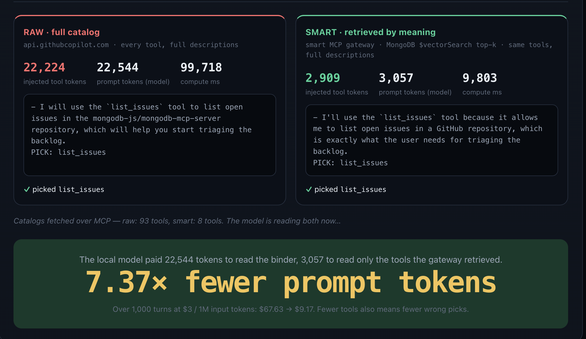

# mcpx-demo — Smart MCP Gateway



A token-disciplined, **route-by-meaning** gateway for the **Model Context
Protocol (MCP)**. It sits in front of your MCP tools and stops the "flat
injection" anti-pattern — dumping every tool description into the model's context
on every turn — by embedding the whole catalog once and, when the caller just
*says what they're doing*, retrieving only the handful of tools that task needs —
by **meaning**, via MongoDB `$vectorSearch`. Nothing to declare, no
hardcoded policy: relevance is learned from the tools' own descriptions.

The demo proxies the **real, official GitHub MCP server**
(`https://api.githubcopilot.com/mcp/`) — ~93 verbose tools (this number grows as GitHub adds more!), ~21,830 tokens of
catalog injected every turn. Send the gateway a free-form task like *"review this
pull request"* and it hands back the **8 tools that task needs** — **byte-for-byte
identical** to the firehose, just 8 instead of 93 — for a **~8.8× lighter** handoff.
Same protocol, same model, same task; the *only* thing that changes is how many
tools cross the wire. All you need is a GitHub Personal Access Token.

This isn't a fringe idea: the same route-by-meaning pattern now ships as a managed
feature in AWS's Bedrock AgentCore Gateway (its built-in
[`x_amz_bedrock_agentcore_search`](https://docs.aws.amazon.com/bedrock-agentcore/latest/devguide/gateway-using-mcp-semantic-search.html)
tool) and in Anthropic's tool search — confirmation that the fix lives at the
gateway layer, not in the MCP protocol.

> Want the why behind it? Read [`blog.md`](./blog.md) —
> *"How a Few Bad MCP Servers Pushed Us to Build a Gateway on MongoDB"* — and its
> production follow-up [`blog2.md`](./blog2.md) on identity, resiliency, and the
> levers beyond retrieval.

## TL;DR

First drop a GitHub Personal Access Token into `.env` (the gateway proxies the
real GitHub MCP server, so it needs one. A read-only token works for the demo, but executing actions requires write access):

```bash
echo 'GITHUB_PAT=ghp_your_token_here' > .env   # https://github.com/settings/personal-access-tokens/new
```

One command builds the gateway **and** MongoDB Atlas Local, waits for health, and
seeds the route-by-meaning catalog in the background so the live demo is ready the
moment it opens:

```bash
docker compose up        # build + start + seed, then open http://localhost:8000/
```

`docker compose down -v` stops the stack and wipes the volumes for a clean slate.

## What it does

The gateway is a single FastAPI process that mounts a FastMCP server at `/mcp`.
Two layers keep the model's context lean — and only one of them touches tokens:

1. **`SafetyFloorTransform`** — the safety floor and the *only* hand-written rule.
   Destructive tools — those the upstream flags `destructiveHint` (e.g. GitHub's
   `delete_file`) — are *never* exposed, in both directions, so a semantic match
   can never surface (nor a client invoke) one. The verdict comes entirely from
   the upstream's MCP annotations; the gateway never guesses from a tool's name.
2. **`SemanticFilterMiddleware`** — the per-request brain, and the whole token
   story. It reads the caller's free-form `X-MCP-Query`. If present (and the
   embedded catalog is ready), it retrieves the top-k tools by *meaning* — one
   MongoDB `$vectorSearch` over the embedded catalog — and returns only those,
   **descriptions untouched**. With **no query** it serves the full (safety-floored) catalog, so
   the gateway is never worse than an honest proxy. It caches per
   `(query, catalog-fingerprint)` for a short TTL.

The savings come from exactly one move: handing the model **fewer** tools, never
**shorter** ones. Every tool the model sees is byte-for-byte what the upstream
published, so the win is 100% attributable to retrieval — nothing is hidden in
trimmed text.

### Route by meaning, not by hand

There is **no hardcoded routing policy**, no operator-owned table answering *"what
is this caller allowed to see?"* — the thing that made earlier MCP gateways brittle.
The gateway embeds every tool's name + description once and lets `$vectorSearch`
decide relevance. You don't pre-declare anything; you describe the work in plain
words and the gateway finds the tools:

- A query like *"review this pull request"* lands on `pull_request_read`,
  `list_pull_requests`, `create_pull_request`, … — purely from meaning.
- A colloquial, keyword-free query like *"the CI workflow runs are failing"* lands
  on `actions_list`, `actions_get`, `get_job_logs` — zero shared keywords, matched
  by the embedding alone.
- *"stamp a new version and ship it to users"* lands on `get_latest_release` /
  `list_releases` — again, no literal overlap; the vector space does the work.

The token savings and the *right tools, ranked* both come from this one hop. It's
exercised live in the dashboard's **"Run one live session"** A/B (and on the MCP
hot path via the `X-MCP-Query` header), and detailed under
[Route by meaning](#route-by-meaning-mongodb-vector-search) below.

### One idea, on purpose

Token bloat has two faces — an *input* tax (the schema/description dump on every
`tools/list`) and an *output* tax (fat tool *results* on `tools/call`). This demo
deliberately tells **one** story: the input side, solved the cleanest possible
way — **retrieval**. Hand the model only the tools the task needs, with their text
left exactly as published.

Two further levers stack on top to squeeze even more: **description pruning** (trim
each tool's text) and **response compaction** (shrink oversized results). They're
real and useful, but they change *what the model reads*, which would muddy the one
clean claim this demo makes ("we changed only the count"). So they're kept **out of
the headline** and live in the "you can go further" chapter — see
[Further hardening](#further-hardening) below, and the production follow-up
[`blog2.md`](./blog2.md).

### Request header

The gateway's entire interface is **one header** — just say what you're doing:

| Header          | Default   | Purpose                                                                              |
| --------------- | --------- | ------------------------------------------------------------------------------------ |
| `x-mcp-query`   | *(none)*  | A free-form description of the task. The gateway embeds it and returns the top-k tools by meaning (descriptions untouched). No query ⇒ the full catalog. |

### Safety floor

Destructive tools are *never* exposed — not in `tools/list`, and not callable by
name (a blocked call is indistinguishable from a nonexistent tool). This is the
only static rule in the gateway, and it's a guardrail, not an authorization model:
it just guarantees a high-scoring semantic match for *"clean up the repo"* can't
hand the model `delete_repository`. Toggle with `MCPX_BLOCK_DESTRUCTIVE` (default
on). You can see exactly what it hides on the dashboard's **Safety floor** panel
(or `GET /demo/safety`).

#### How a tool is judged destructive

`is_destructive()` in [`app/gateway/github_proxy.py`](./app/gateway/github_proxy.py)
reads the upstream's own MCP tool annotations and nothing else — they're the
authoritative signal:

1. **`readOnlyHint` → never destructive.** A tool the upstream marks read-only
   can't destroy anything, so it's always allowed.
2. **`destructiveHint` → destructive.** The upstream's explicit flag wins; the
   tool is hidden in both directions.
3. **Unannotated → taken at face value.** If the upstream supplies no risk hint,
   the gateway does *not* guess from the name — it leaves the tool exposed. That
   isn't a gap to paper over with string-matching; it's a missing annotation, and
   the right place to fix it is the upstream server. Annotations are the MCP
   spec's risk vocabulary, and they double as a signal that helps a model pick the
   *right* tool, not just the *safe* one. GitHub, for instance, flags `delete_file`
   `destructiveHint` but leaves `label_write` and `manage_notification_subscription`
   — both of which expose a `delete` method — unannotated; a name backstop would
   sail right past those, which is exactly why guessing from names is the wrong
   layer for the fix.

#### Customize the floor

Two levers — plus the real fix, which is annotation:

- **Toggle the floor** — `MCPX_BLOCK_DESTRUCTIVE=false` disables it entirely
  (default on). The catalog still loads; nothing is hidden.
- **Filter at the source** — `MCPX_GITHUB_READONLY=true` asks the upstream GitHub
  MCP server for a read-only catalog, so write/destructive tools never reach the
  gateway in the first place.

To cover a tool the upstream forgot to flag, the durable fix lives upstream: get
the tool annotated `destructiveHint` (or run the catalog read-only). The gateway
deliberately keeps no list of "scary" tool names of its own.

Because the retrieval catalog is built from the *floored* tool list, anything the
floor drops is never embedded — so it can't be retrieved *or* invoked.

### Upstream: the real GitHub MCP server (proxied)

The gateway is a **FastMCP proxy** to the official remote GitHub MCP server
(`https://api.githubcopilot.com/mcp/x/all`, authenticated with your `GITHUB_PAT`).
It pulls the live catalog (~93 tools across issues, pulls, repos, actions,
releases, orgs, search, and more), applies the safety floor, and embeds each
surviving tool's name + description into `tool_catalog` for retrieval. Tool calls
are forwarded natively to GitHub and their JSON results flow straight back,
untouched. (If GitHub's cloud endpoint is momentarily down during a local restart, don't worry—the gateway reuses the cached catalog and embeddings from MongoDB, making startup instant and resilient). No PAT? The process won't start — this is a real integration, not a
mock.

## HTTP endpoints

| Endpoint                | What it returns                                              |
| ----------------------- | ----------------------------------------------------------- |
| `GET /` · `GET /demo`   | The live token-savings dashboard (HTML).                    |
| `GET /demo/safety`      | Read-only view of the safety floor: how many destructive tools the floor hides, which ones, and whether the floor is enabled. Powers the dashboard's **Safety floor** panel. |
| `GET /demo/try/config`  | Config for the live "try it yourself" panel (local-runtime readiness + detected Ollama models, demo tasks). |
| `POST /demo/try`        | Runs a task through a **local** model twice (raw vs smart) and returns the model's own token usage, per-pass latency, and tool pick. Fully on-device via Ollama — no key, nothing leaves the machine. The smart pass hands the gateway the task as `x-mcp-query`. |
| `POST /demo/try/stream` | Same run as `POST /demo/try`, but streamed as Server-Sent Events (`infer` → `token` → `result` → `summary`) so the dashboard can show prefill, live token output, and per-pass timing. |
| `GET /health`           | `{"status": "healthy", ...}`                                |
| `/mcp/`                 | MCP Streamable HTTP transport (point your MCP client here). |

## Dashboard

Open **http://localhost:8000/** once the gateway is running. It walks you through
the thesis — *MCP isn't the problem, how you use it is* — top to bottom:

- A **single live session**: pick or edit a task, press **Run**, and the page first
  fetches the real `tools/list` bill — the **official GitHub MCP server's** full
  firehose vs the tools **this gateway retrieves for that task by meaning** — then
  immediately makes the local model pay both bills. If the vector index is still
  warming up, the page says so and stops before model inference instead of
  pretending the fail-open full catalog is the savings.
- The **"Show the agent code" modal**: two tiny, near-identical MCP clients — one
  pointed at the **official GitHub MCP server**, one at **this gateway** sending an
  `x-mcp-query` header. Same client library, model, and task; the only difference
  is which server you call and how much it hands back.
- The **main event — "Run live comparison"**: a **Try it yourself** panel that runs
  **entirely on your machine** via [Ollama](https://ollama.com) (default
  `qwen3:14b`; the win is structural so it shows up at any size). It's pointed at a
  real public repo — [`mongodb-js/mongodb-mcp-server`](https://github.com/mongodb-js/mongodb-mcp-server),
  MongoDB's own open-source MCP server — and runs the *identical prompt* through
  the model twice against **two different servers**: the **raw** pass calls the
  **official GitHub MCP server** directly (the full ~93-tool kitchen sink), while
  the **smart** pass hands **this gateway** the task as `x-mcp-query` and gets back
  only the retrieved top-k. (The raw pass authenticates with your `GITHUB_PAT`
  **server-side**, so no token ever reaches the browser.) A live, streamed console
  shows each pass paying its bill — prefill, token output, per-pass latency — then
  reports the **model's own** prompt-token counts, which tool each picked (✓/✗),
  and a hosted-cost projection.
- A **single, focused control surface**: the page keeps only what proves the demo's
  claim (live bill + live model A/B) plus the **Safety floor** panel, and leaves
  deeper route-debugging to `scripts/seed_catalog.py` instead of crowding the UX.

The dashboard's numbers use the exact same tiktoken logic (`app/tokens.py`) as the
live gateway, so what you see is what an MCP client actually pays.

## Running it

### Option A — Docker (recommended)

`docker compose up` builds and starts the gateway **and** MongoDB Atlas Local (a
single-node deployment that speaks the Atlas wire protocol *and* ships Vector
Search, so telemetry, audit, and semantic routing (`$vectorSearch`) all run on one
engine, locally). The catalog is embedded + indexed in the background on startup:

```bash
docker compose up            # build + start + seed -> http://localhost:8000/
docker compose logs -f       # tail logs
docker compose down -v       # stop + wipe Mongo volumes -> clean slate next time
```

Seeding is best-effort: if a host dep or the local embedder is missing, the stack
still comes up and the gateway serves the full catalog (never worse than a proxy).

### Option B — Local Python

```bash
python -m venv .venv && source .venv/bin/activate
pip install -r requirements.txt
docker compose up -d mongo                                    # Atlas Local on :27019
export MCPX_MONGO_URI="mongodb://localhost:27019/?directConnection=true"
uvicorn app.main:combined_app --host 0.0.0.0 --port 8000      # gateway on :8000
```

The catalog seeds automatically on startup. To (re)seed by hand:

```bash
ollama pull nomic-embed-text                                  # one-time: 768-dim embedder
PYTHONPATH=. python scripts/seed_catalog.py
```

Skip Mongo entirely and the gateway still runs standalone — Mongo writes become
no-ops, semantic retrieval falls back to serving the full catalog, and the live
on-device demo is unaffected (it needs no database).

### Route by meaning (MongoDB Vector Search)

This is the whole gateway: route a **free-form task** to the *right* tools by
*meaning*. Each surviving tool becomes one document in `tool_catalog` with a
**local** embedding (Ollama `nomic-embed-text` — no keys, on-device); a query is
embedded the same way and matched with a single `$vectorSearch` over that
collection, and the top-k come back. A colloquial query like *"the CI workflow
runs are failing"* shares no keywords with GitHub's terse tool names, yet lands on
`get_job_logs` / `actions_list` — the embedding alone does it. (Want a hybrid
lexical arm? MongoDB does keyword `$search` on the same documents; the demo stays
deliberately to one clean mechanism — see the blog appendix.)

It's live on the MCP hot path via the `X-MCP-Query` header (and surfaced in the
dashboard's live A/B); `scripts/seed_catalog.py` prints the ranked `$vectorSearch`
hits for a handful of colloquial queries as an offline proof. Everything fails
open: no Mongo, no indexes, or no local embedder and the gateway serves the full
catalog — never worse than a plain firehose proxy.

## Configuration

Copy [`.env.example`](./.env.example) to `.env` and adjust. The one **required**
value is `GITHUB_PAT` (the upstream GitHub MCP credential — no `MCPX_` prefix, to
match GitHub's own convention); every other setting is `MCPX_`-prefixed. The live
demo runs on a local Ollama model (no cloud, no extra keys). Key knobs:

| Variable                            | Default                  | Purpose                                  |
| ----------------------------------- | ------------------------ | ---------------------------------------- |
| `GITHUB_PAT`                        | *(required)*             | PAT for the upstream GitHub MCP server (no `MCPX_` prefix). The gateway won't start without it. |
| `MCPX_GITHUB_REMOTE_URL`            | `https://api.githubcopilot.com/mcp/x/all` | Upstream GitHub MCP endpoint (the `/x/all` path exposes every toolset). |
| `MCPX_GITHUB_READONLY`              | `false`                  | Ask the upstream for a read-only catalog (no write/destructive tools at all). |
| `MCPX_QUERY_HEADER`                 | `x-mcp-query`            | Header carrying a free-form task → route by meaning. |
| `MCPX_BLOCK_DESTRUCTIVE`            | `true`                   | Hide destructive tools (the safety floor). |
| `MCPX_LIST_CACHE_TTL_SECONDS`       | `5.0`                    | `tools/list` cache TTL.                   |
| `MCPX_MONGO_URI`                    | *(unset)*                | Enables telemetry/audit + the embedded catalog. |
| `MCPX_MONGO_DATABASE`               | `mcpx`                   | Mongo database name.                     |
| `MCPX_OLLAMA_HOST`                  | `http://localhost:11434` | Local Ollama runtime for the on-device "try it yourself" panel + query embeddings. |
| `MCPX_OLLAMA_MODEL`                 | `qwen3:14b`              | Default local model for the playground.  |
| `MCPX_EMBED_MODEL`                  | `nomic-embed-text`       | Local embedding model for route-by-meaning (`ollama pull` it). |
| `MCPX_EMBED_DIMENSIONS`             | `768`                    | Embedding width; must match the Vector Search index. |
| `MCPX_SEMANTIC_RETRIEVAL_ENABLED`   | `true`                   | Retrieve by meaning when `X-MCP-Query` is present + catalog seeded. |
| `MCPX_ROUTE_TOP_K`                  | `8`                      | Tools returned per free-form query.      |
| `MCPX_ROUTE_NUM_CANDIDATES`         | `100`                    | `$vectorSearch` candidate pool before the top-k. |

With Mongo enabled, the gateway populates `token_telemetry` (per-`tools/list`
cost + the query that drove it), `invocation_audit` (per-`tools/call` query, tool,
redacted args, latency), and — once seeded —
`tool_catalog` (one document per tool with its description + local embedding,
indexed for Vector Search). Persistence uses PyMongo's native async API
(`AsyncMongoClient`), not the deprecated Motor driver.

## Project layout

```
app/
  main.py            # FastAPI + FastMCP wiring (combined_app) + /demo routes
  settings.py        # MCPX_-prefixed settings + GitHub PAT/URL (no routing policy)
  tokens.py          # tiktoken-based token measurement
  ollama.py          # local Ollama client: chat + embeddings (no cloud, no keys)
  gateway/
    github_proxy.py  # proxy to the real GitHub MCP server + destructive detection
    headers.py       # the one request-header helper (x-mcp-query)
    transforms.py    # SafetyFloorTransform (the only static rule)
    middleware.py    # SemanticFilterMiddleware (x-mcp-query -> vector top-k)
    preview.py       # read-only catalog loaders + /demo/safety floor introspection
    playground.py    # live on-device A/B driver (raw vs smart, streamed)
  persistence/       # optional Mongo (PyMongo async): client, telemetry,
    catalog.py       #   route-by-meaning ($vectorSearch) — the core
  static/            # dashboard.html (the /demo UI)
scripts/seed_catalog.py # embed the catalog + build the Vector Search index
```

## Requirements

- A **GitHub Personal Access Token** in `.env` as `GITHUB_PAT` — the gateway
  proxies the real GitHub MCP server, so this is required.
  [Create one](https://github.com/settings/personal-access-tokens/new) with the
  scopes you want the agent to have (a fine-grained, read-only token is plenty for
  the demo).
- Python ≥ 3.11 (Docker image uses 3.12)
- For Docker: Docker + Docker Compose
- For route-by-meaning + the live demo: a local [Ollama](https://ollama.com) with
  the embedding model pulled (`ollama pull nomic-embed-text`) and a chat model
  (`ollama pull qwen3:14b` — any size works; smaller is faster). Optional — the
  gateway falls back to the full catalog without it.
- Optional: MongoDB (telemetry + the embedded catalog). Without it, semantic
  retrieval is disabled and the gateway serves the full catalog.

## Further hardening

Routing by meaning is the floor, not the ceiling. A few **additive** levers shrink
the handoff further or narrow the chance of a wrong-tool pick — all of them stack
*on top* of retrieval without changing the clean headline claim:

- **Description pruning** — trim each retained tool's text to a single capped line.
  A small extra input-side win on top of the count reduction.
- **Response compaction** — the output-side mirror: shrink fat `tools/call` results
  (drop nulls, cap arrays, truncate strings) before they hit the model's context.
- **Identity-derived scope** — turn a verified identity/role into a metadata
  pre-filter on the vector query (entitled *and* relevant in one `$vectorSearch`).
- **Abstain on low confidence** — when retrieval scores are weak or tied, return
  fewer tools or ask the agent to disambiguate instead of guessing.
- **Re-rank the shortlist** — a cross-encoder or small LLM reorders the top-k by
  true task-fit (cheap: it runs over ~20 candidates, never the firehose).
- **Dynamic top-k** — size `k` to retrieval confidence (tight for sure things).
- **Close the loop** — mine the `invocation_audit` trail for mis-routes and fix
  the descriptions/embeddings that caused them; the catalog improves with use.

Pruning and compaction once lived *in* this gateway; they were pulled out so the
demo could make a single, airtight point — fewer tools, identical text. The long
version — with the identity story and the MongoDB mechanics — is the production
follow-up post, [`blog2.md`](./blog2.md).
