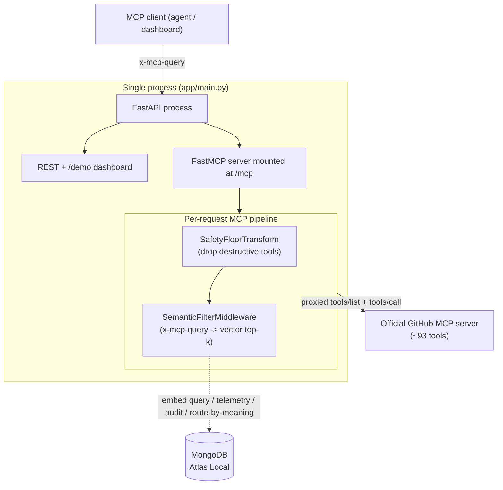
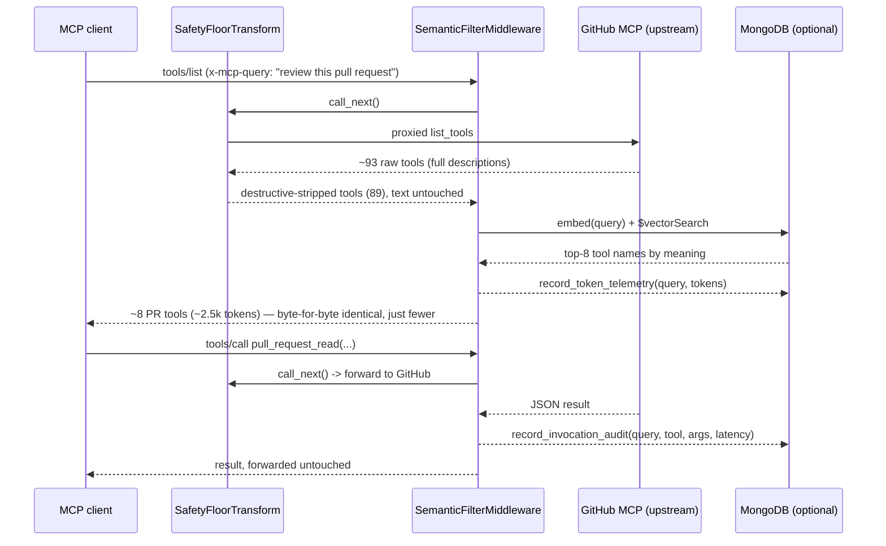

# Architecture — mcpx-gateway

This document goes one level below the [`README.md`](./README.md): how the gateway
is actually wired, why the request pipeline is ordered the way it is, and why
MongoDB is the right substrate for everything that isn't on the hot path. The
guiding idea borrows from [`stack.md`](./stack.md): *don't add a new engine for
every new concern your primary substrate can already hold.*

The whole gateway is a single FastAPI process that mounts one FastMCP **proxy**
to the real GitHub MCP server. There is no second service, no queue, no sidecar
search cluster. The cleverness is entirely in **how requests flow through a small
stack of composable layers** — and in the one genuinely smart move: embed the
upstream's whole catalog once, then **retrieve the tools a task needs by meaning**
with MongoDB `$vectorSearch`, instead of declaring a hardcoded policy
by hand.

---

## 1. The big picture



Two planes:

- **The data plane (hot path).** `tools/list` and `tools/call` flow through the
  transform stack and middleware. This path must be fast and must never break, so
  MongoDB is *optional* here — if it's down or unset, the gateway serves the full
  catalog and every request still works correctly.
- **The control / analytics plane (off path).** Telemetry, the invocation audit,
  and the route-by-meaning catalog all live in MongoDB. None of them is allowed to
  take down a request.

---

## 2. The pipeline, and why order is everything

The server is assembled in `build_mcp_server()`:

```python
mcp = build_github_proxy(settings)
mcp.add_transform(SafetyFloorTransform(enabled=settings.block_destructive))  # 1. safety floor
mcp.add_middleware(SemanticFilterMiddleware())                               # 2. semantic gate
```

Just two layers, and only one of them touches tokens. The key architectural
distinction is **transforms vs. middleware**:

| Concern | Mechanism | Scope | Question it answers |
| --- | --- | --- | --- |
| Safety | `SafetyFloorTransform` | server-level | "What must *never* exist, for anyone?" |
| Selection | `SemanticFilterMiddleware` | per-request | "Which tools does *this task* actually need?" |

Transforms shape **what components exist** across the whole server. They are
*static* with respect to the caller — they don't care who's asking. Middleware is
**per-request** and *dynamic* — it reads the `x-mcp-query` header and decides what
this specific request sees. Ordering them correctly is what makes the whole thing
a clean stack rather than a tangle:

1. **`SafetyFloorTransform` runs first.** A destructive tool should never reach the
   layer that decides visibility, nor get embedded into the retrieval catalog. Drop
   it at the floor, in both directions.
2. **`SemanticFilterMiddleware` runs last (and per request).** By the time it sees
   the tool list, destructive tools are already gone. Its only job is the *dynamic*
   cut: embed the task, retrieve the top-k by meaning — or, with no query, pass the
   full catalog through. It **never rewrites a tool**; the descriptions it returns
   are byte-for-byte what the upstream published.

This is the separation of concerns the README gestures at, made concrete: each
layer owns exactly one decision, and the layers compose because they run in
dependency order. The pipeline's token savings come from returning fewer tools for
the task, and it never rewrites tool text.

---

## 3. Layer-by-layer

### 3.1 `SafetyFloorTransform` — the safety floor (`app/gateway/transforms.py`)

The simplest and most important layer, and the *only* hand-written rule in the
gateway. It drops any tool `is_destructive()` flags — and that verdict comes
entirely from the upstream's own annotations (`readOnlyHint` ⇒ always safe,
`destructiveHint` ⇒ destructive); the gateway never guesses from a tool's name —
in **both** directions:

```python
async def list_tools(self, tools):
    return [t for t in tools if not is_destructive(t)]

async def get_tool(self, name, call_next, *, version=None):
    tool = await call_next(name, version=version)
    if tool and self.enabled and is_destructive(tool):
        return None       # invisible to lookup-by-name too
    return tool
```

Why it's a *floor* and not just a filter: it sits above the semantic middleware and
is caller-independent. **No query — not even a high-scoring semantic match for
"clean up the repo" — can resurrect a destructive tool.** Hiding it from
`list_tools` alone would be theater (a client could still call a tool it already
knows by name), so `get_tool` enforces the same rule on the lookup path. And because
the retrieval catalog is built from the *same* floored tool list (§5), destructive
tools are never even embedded, so they can never be retrieved. The destructive
`delete_file` is gone for everyone, permanently. This is a *guardrail*, not an
authorization model — it answers "what is unsafe?", never "who is this caller?".

**Where the judgement lives / how to edit it.** The destructive judgement is
`is_destructive()` in `app/gateway/github_proxy.py`, and it reads the upstream's
MCP annotations *only* — `readOnlyHint` short-circuits to *safe*, `destructiveHint`
short-circuits to *destructive*, and an unannotated tool is taken at face value.
There is no name heuristic: guessing "delete" from a tool name is unreliable (it
sails right past a `label_write` tool whose destructive `delete` hides in a method
parameter) and it's the wrong layer for the fix — annotating tools for risk is the
upstream server's job. To cover a tool the upstream forgot to flag, fix it at the
source (annotate the tool, or set `MCPX_GITHUB_READONLY=true` for a read-only
catalog); to turn the floor off, set `MCPX_BLOCK_DESTRUCTIVE=false`. The read-only
`GET /demo/safety` endpoint diffs the raw vs floored catalogs so the dashboard's
**Safety floor** panel can show exactly what's hidden and why.

### 3.2 `SemanticFilterMiddleware` — the per-request brain (`app/gateway/middleware.py`)

On `on_list_tools` it:

1. Reads the caller's free-form `x-mcp-query` (`app/gateway/headers.py`).
2. If a query is present and the Mongo catalog is seeded, calls `search_tools` to
   retrieve the top-k tools **by meaning** (one `$vectorSearch` over the embedded
   catalog) and returns only those — descriptions intact. With no query — or on any
   retrieval miss — it returns the full (floored) catalog.
3. Caches the result by `(query, tool-name/description fingerprint)` in a small
   bounded TTL+LRU cache (`_TTLCache`, default 5s) so repeated list calls in one
   conversation are nearly free.
4. Records the post-retrieval token cost (and the query that drove it) to telemetry.

Two correctness properties matter:

- **Never worse than a proxy.** Selection is pure relevance, not authorization, so
  the fallback is the *full catalog*: if Mongo is off, the embedder is missing, or
  the indexes aren't built yet, the caller simply gets every (safe) tool — exactly
  what a plain proxy would serve. There is no fail-closed surprise because there is
  no policy to fail.
- **Safety is enforced by the floor, not here.** Because `SafetyFloorTransform`
  already makes destructive tools invisible to both `list_tools` *and* `get_tool`, a
  client that knows a destructive tool's name still can't invoke it — the call path
  resolves it to "unknown tool." The middleware doesn't need a separate
  authorization re-check; it just forwards the call (and records an audit row).

Route-by-meaning (§5) is the entire selection mechanism here — not an optional
re-rank bolted onto a hardcoded list. The query *is* the interface.

---

## 4. Why this is "clean" separation of concerns

Each layer is independently testable and independently disablable:

- The safety floor is a pure function of `(tools, name)` — `is_destructive`
  exercises with **no server and no Mongo**.
- The safety floor doesn't know retrieval exists. The semantic middleware doesn't
  care how a tool got into the catalog — it only ranks what's there.
- The only shared vocabulary between layers is **the tool's description** (what gets
  embedded) and one header name — defined once in `app/settings.py` and reused by
  the live gateway *and* the demo routes, so the numbers on screen are computed
  by the same primitives the gateway runs — over the *same* full, untrimmed tool
  text the model actually sees.

That single-source-of-truth discipline is what keeps the demo honest: there's no
"marketing math" path separate from the real path, no text quietly trimmed on one
side of the comparison, and no hand-maintained policy table that can drift from the
tools it claims to describe.

---

## 5. Why MongoDB is such a good fit

Everything above runs without a database. So why is MongoDB the *right* choice for
the parts that do use one? Because the gateway has two off-path concerns — **search
and analytics** — and [`stack.md`](./stack.md) makes the case that those are exactly
the concerns teams reflexively spin up separate systems for (Elasticsearch +
Pinecone for search; Snowflake/BigQuery for analytics). The gateway collapses them
onto **one BSON substrate**, and the fit is unusually clean here.

### 5.1 One engine, two jobs

`docker-compose.yml` runs a single `mongodb/mongodb-atlas-local` node. That image
matters: it speaks the Atlas wire protocol **and** ships the Vector Search
engine locally, so both collapses happen on one deployment:

| stack.md "plane" | In this project | Collection(s) |
| --- | --- | --- |
| **Search** (a vector DB) | Route-by-meaning, `$vectorSearch` | `tool_catalog` |
| **Analytics / observability** | Discovery-token telemetry + invocation audit | `token_telemetry`, `invocation_audit` |
| **Operational store** | All of the above, same `mcpx` DB | — |

No ETL between them, no second query dialect, no drift between "the index" and "the
data." This is the [`stack.md`](./stack.md) thesis in miniature.

### 5.2 Vectors, on the same documents (`app/persistence/catalog.py`)

This is the most striking fit, and now it's the *whole* selection mechanism.
Route-by-meaning needs **semantic** matching ("the CI workflow runs are failing" →
the Actions tools, with no shared keywords). The textbook architecture is a separate
vector DB fed by its own pipeline. Here it's one collection with one Atlas index:

- `tool_vector` — a Vector Search index over a local 768-dim embedding
  (`nomic-embed-text` via Ollama, no cloud, no keys).

```python
async def search_tools(query, *, k=8, cfg=settings):
    vec = await embed(query)                          # local, on-device
    if not vec:
        return None                                   # no embedder -> fall back
    hits = await _vector_arm(coll, vec[0], k, cfg)    # one $vectorSearch
    return [h["name"] for h in hits] or None
```

`search_tools` runs a single `$vectorSearch` and returns the top-k tool names. There
is **no tag filter and no authorization predicate** in the query — that was the old,
hardcoded design. Relevance is decided entirely by the tools' own embedded
descriptions, which is what makes "just say what you're doing" work. And the catalog
is built from the *same* floored tool list the live gateway sees (`_load_catalog`),
so there is one source of truth for "what tools exist" — no sync job to drift, and
destructive tools (hidden by the floor) are never embedded.

> **One arm, on purpose.** MongoDB also serves keyword `$search` on these very same
> documents, so a hybrid lexical+vector arm (fused with RRF) is a drop-in addition.
> The demo deliberately keeps it to a single `$vectorSearch` so the token win is
> attributable to *one* clean mechanism — see the production follow-up
> [`blog2.md`](./blog2.md) for hybrid retrieval and re-ranking.

### 5.3 Telemetry + audit, where the data already is (`app/persistence/telemetry.py`)

Every `tools/list` records its post-retrieval token cost and the query that drove
it; every `tools/call` records the query, tool, redacted args, and latency. Those
documents are what the dashboard aggregates to prove the savings — analytics on live
operational data, no warehouse, no export. Arguments are redacted before storage (`redact_args` masks
`password`/`token`/etc. and truncates long values), which is the security boundary
stack.md is careful about: collapse the operational analytics, but don't smear
secrets across it.

### 5.4 The honest part: fail-open, because it's one basket

[`stack.md`](./stack.md)'s sharpest caution is that collapsing planes onto one store
means they **share fate** — a cluster outage costs you more than your data. The
gateway answers this the right way: **MongoDB is never on the hot path.**

- `get_database()` returns `None` when `MCPX_MONGO_URI` is unset, and **every writer
  becomes a no-op** (`telemetry`, `audit`).
- `startup_mongo` catches connection failures and logs them rather than crashing —
  "a telemetry backend should not be able to take down the gateway."
- Route-by-meaning falls back to the **full catalog** on *any* miss — Mongo off,
  indexes not ready, or the local embedder missing.

So the gateway gets the upside stack.md sells — one engine, no ETL, no drift, one
operational paradigm — while sidestepping the "one basket" risk by keeping the
basket strictly optional. The request path degrades to "never worse than a plain
firehose proxy," and the data/control plane is pure upside when present. It uses
PyMongo's native async client (`AsyncMongoClient`), not the deprecated Motor driver,
throughout.

---

## 6. End-to-end: a single "review this PR" request



The same protocol, the same upstream, the same model — the only variable a caller
changes is a header that says what they're doing, and the only thing the gateway
changes in return is *how many* tools come back. That's the entire design: **the
intelligence is in the embeddings and the substrate choice, not in any
hand-written policy — and not in trimming a single byte of tool text.**

---

## 7. File map

| Path | Responsibility |
| --- | --- |
| `app/main.py` | Wires the proxy + safety floor + middleware; mounts MCP under `/mcp`; `/demo` routes |
| `app/settings.py` | `MCPX_`-prefixed config (no routing policy), GitHub PAT/URL, retrieval knobs |
| `app/gateway/github_proxy.py` | Proxy to the real GitHub MCP server + `is_destructive` |
| `app/gateway/headers.py` | The one request-header helper (`x-mcp-query`) |
| `app/gateway/transforms.py` | `SafetyFloorTransform` — the only static rule (drop destructive tools) |
| `app/gateway/middleware.py` | `SemanticFilterMiddleware`: per-request retrieval, cache, telemetry |
| `app/gateway/preview.py` | Read-only catalog loaders (raw + safety-floored) + `safety_floor_status()` behind `/demo/safety` |
| `app/gateway/playground.py` | Live on-device A/B driver (raw vs smart, streamed) |
| `app/persistence/client.py` | Async Mongo lifecycle; no-op mode when unconfigured |
| `app/persistence/telemetry.py` | Token telemetry + invocation audit writers (redacted, fire-and-forget) |
| `app/persistence/catalog.py` | Route-by-meaning: `$vectorSearch` over `tool_catalog` |
| `docker-compose.yml` | Gateway + MongoDB Atlas Local (one engine: wire protocol + Vector Search) |
