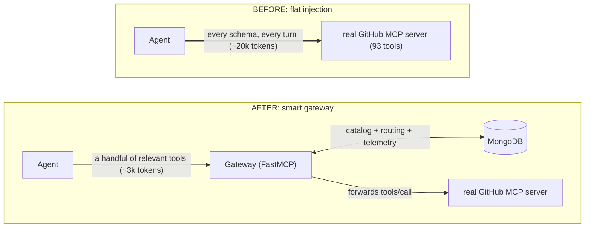
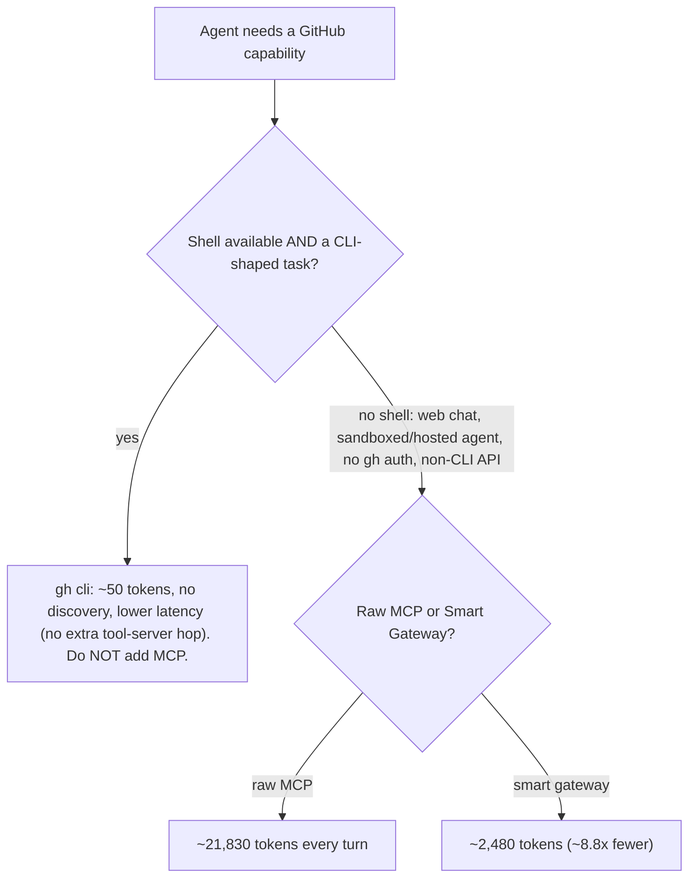

# How a Few Bad MCP Servers Pushed Us to Build a Gateway on MongoDB

This didn't start as a MongoDB story. It started as an annoyance.

We were wiring a handful of Model Context Protocol (MCP) servers into an internal agent — the usual suspects, plus a couple of homegrown ones. And the agent got *slow*. And *expensive*. Responses that should have been snappy were dragging, and the token bill for "go look something up" was wildly out of proportion to the work being done.

So we did the boring, unglamorous thing: we measured it. And the measurement is what eventually led us to rebuild the whole thing as a gateway on MongoDB. Here's the journey, the numbers, and why MongoDB turned out to be the obvious platform for this kind of system.

Here's the entire idea in one picture: the shift from every server shouting its full catalog at the agent, to a single gateway that hands over only what the moment needs. (That gateway is built with **FastMCP** — the Python framework that implements the MCP protocol for you, and the implementation layer we chose to stand the whole thing up. More on the exact division of labor below.)



---

## The thing we stumbled into

Here's the analogy that finally made it click.

Imagine walking into a coffee shop and, before you can say "flat white," the barista hands you a 500-page binder listing every bean in every warehouse they've ever sourced from, and says: "Read this first, then tell me what you want."

That's what a lot of MCP servers *currently choose to* do to an LLM. The moment a client connects, the server dumps the **entire** catalog of tools — every name, every description, every parameter schema — into the model's context window. Before the agent does a single useful thing, it has already "read the binder." Every turn. Even when the user just wanted a flat white.

And here's the part to hold onto: this is a *server-implementation* problem, not a *protocol* problem. Nothing in MCP says you must hand over the whole binder — that's a choice each server makes, and a different choice is what the rest of this post is about.

Some servers were worse than others. The well-known public ones were the worst offenders precisely because they're comprehensive: hundreds of tools, each with a paragraph of documentation. Comprehensive is great for humans browsing docs. It's brutal for a token budget.

One framing worth planting now, because it shapes everything below: token bloat has *two* faces. The binder is the **input** half — schema and descriptions injected before the agent does anything. But there's an **output** half too: once a tool actually runs, it dumps its raw payload straight back into the conversation, and a verbose CRM blob or a wall of telemetry can be just as ruinous as the catalog that preceded it. This post is overwhelmingly a story about the input half — that's where our gateway lives and what our benchmark measures — but the output half is real, and we come back to it near the end. (Our own demo tools already nod at it: each one's description warns that it "returns the full upstream payload and is correspondingly expensive in context tokens.")

## We weren't the only ones who noticed

While we were staring at our own token bill, a small library of "is MCP actually worth it?" posts was piling up — and read back to back, they tell a surprisingly consistent story. The critics are right about the symptoms, and almost unanimous about the cause, even when their titles read like obituaries.

Start with the most credible witness, because he has the least incentive to talk down his own work: **Jeremiah Lowin, the creator of FastMCP** — the very framework this gateway runs on. He built the one-line "convert your whole REST API to MCP" feature, watched people ship it straight to production, and then wrote a post telling them to stop: ["Stop converting your REST APIs. Start curating them."](https://www.jlowin.dev/blog/stop-converting-rest-apis-to-mcp) The distinction he draws is the entire ballgame: *"An API that is 'sophisticated' for a human is one with rich, composable, atomic parts. An API that is 'sophisticated' for an agent is one that is ruthlessly curated and minimalist."* He even names the exact failure mode we hit — *"context pollution is the silent killer of contemporary agentic workflows"* — and his prescribed fix is a FastMCP primitive (`Tool.from_tool()`) for rewriting a sprawling tool into a lean one. We take the same instinct but apply it one level up: instead of hand-rewriting each tool, we **curate by selection** — embed the whole catalog once, then return only the handful of tools a task actually needs (with a `SafetyFloorTransform` dropping destructive tools entirely). It's the curation Lowin prescribes, driven from meaning instead of by hand — and without rewriting a single byte of any tool that survives.

Brandon Dennis, under the deliberately spicy title ["MCP Servers Are the Wrong Abstraction,"](https://medium.com/@toady00/mcp-servers-are-the-wrong-abstraction-1e215a358a0f) lands in the same spot the moment you read past the headline: *"The problem isn't MCP existing. It's the ecosystem pressure to bolt MCP onto coding agents that already have a perfectly good way to call the underlying tool directly."* The pattern shows up at survey scale, too — Bloomberry's analysis of 1,400 servers found most are thin wrappers around tools that already ship a CLI, and StackOne's year-in-production retrospective ("what's working, what's broken, and what comes next") catalogs the same tension from the trenches. Even Denis Urayev's ["Why the MCP Standard Might Quietly Fade Away,"](https://medium.com/@denisuraev/why-the-mcp-standard-might-quietly-fade-away-012097caaa85) the bleakest of the bunch, isn't actually indicting the wire format — it's indicting servers that *"expose 40k+ tokens of tool descriptions"* and call it a day.

The cleanest way to see why this is an *implementation* story comes from Layered Systems' ["MCP Tool Schema Bloat,"](https://layered.dev/mcp-tool-schema-bloat-the-hidden-token-tax-and-how-to-fix-it/) which splits token efficiency into **three layers**: the *server* (how verbose are your schemas?), the *protocol* (does MCP even support lazy discovery?), and the *host* (does it forward every tool to the model?). Line the complaints up against those three layers and the protocol column comes back conspicuously empty:

| The complaint | Whose choice it actually is | The protocol's fault? |
| --- | --- | --- |
| 40k–55k tokens of schema for one server | server author — a verbose, uncurated catalog | No |
| Every tool injected on every turn | host — it forwards the whole list | No |
| Wrapping `gh`/`kubectl` that already exist | server author — wrapped what didn't need it | No |
| "Static catalogs don't scale" | host + server — no dynamic discovery offered | No |

Every damning number the critics quote, then, is the output of a decision made *above* the protocol line — which is exactly the seam a gateway lives in.

We had a hunch this was the problem — and now a stack of blog posts nodding along. But a hunch, even a well-cited one, still isn't an engineering argument. So we built a benchmark.

---

## What we measured

We pointed the gateway straight at the canonical offender — the **real, official
GitHub MCP server** (`https://api.githubcopilot.com/mcp/`, ~93 tools (this number grows as GitHub adds more!), each with a
paragraph of documentation and a rich parameter schema) — the kind of catalog
that costs tens of thousands of tokens to inject. Then we set up three ways to
give an agent the capabilities for a real task (review a pull request), and ran
an identical task suite through each:

- **Raw MCP** — the binder. Every tool, full descriptions, every turn.
- **Smart gateway** — you just *say what you're doing* (`x-mcp-query: "review this pull request"`) and the gateway retrieves the handful of relevant tools by *meaning* — same tools, same descriptions, just far fewer of them. Nothing to declare up front.
- **gh cli** — the floor: an agent with a *shell* that already knows `gh` from training, so it just runs the command. No discovery at all.

We counted tokens with the same tokenizer for all three — OpenAI's `cl100k_base` (the tiktoken encoding behind the GPT-4 class), so the numbers are reproducible rather than hand-waved. The result was not subtle:

| approach        | tokens per turn | tools exposed | descriptions     | needs a shell? |
| --------------- | --------------: | ------------: | ---------------- | -------------- |
| Raw MCP         |        ~21,830 |            93 | full             | no             |
| Smart gateway   |         ~2,480 |             8 | full (identical) | no             |
| gh cli (shell)  |             ~50 |             1 | —                | yes            |

(That 93-tool raw row is the *literal* official server — destructive tools and all — which is exactly what the live demo's raw pass calls. Point an MCP client at the gateway with no query and it sees 89: the safety floor drops the four destructive tools like `delete_file`, which is the point.)

Two things to read off that table before you rank the rows:

- **The smart row is the firehose, minus the noise.** Those 8 tools are **byte-for-byte identical** to raw MCP's — same names, same descriptions, same schemas. We did not trim a word. The only variable that changed is *how many* tools cross the wire, which means the ~8.8x is attributable to retrieval and nothing else.
- **`gh cli` isn't in the contest.** It's the cheapest by a mile, but it lives in a different world — the one where the agent *has a shell*. When that's true, the CLI wins outright and you shouldn't be reaching for MCP in the first place.

So the gateway's real opponent is the row right above it — **raw MCP** — and that fight only matters when the shell is off the table. There, **the gateway used ~8.8x fewer tokens than raw MCP for a PR review** — and in the live on-device A/B the *model's own* prompt-token count fell by the same order of magnitude, both passes still picking `pull_request_read` correctly, all while staying a completely standard MCP server.

And these aren't numbers we cooked to make a point — they're measured live against the very server everyone cites. Simon Willison [clocked the real GitHub MCP server at ~55,000 tokens](https://simonwillison.net/2025/Aug/22/too-many-mcps/) just to describe its 93 tools; we count ~21,830 with `cl100k_base` on the current remote catalog (all 93 of them) — catalogs and tokenizers drift between snapshots, but the order of magnitude is the same, and against ~638 tokens for `gh --help` it's still an enormous ratio for the very same integration. Layered Systems found a [MySQL server shipping 106 tools as ~207KB of schema, roughly 54,600 tokens, on every initialization](https://layered.dev/mcp-tool-schema-bloat-the-hidden-token-tax-and-how-to-fix-it/) — even when the model needed two or three of them. Stack a typical 7-server setup and you are [past 67,000 tokens of pure catalog](https://layered.dev/mcp-tool-schema-bloat-the-hidden-token-tax-and-how-to-fix-it/) before the agent reads a line of your code. And it is not only the bill: Jannik Reinhard's head-to-head benchmark scored CLI-based agents at a [Token Efficiency Score of 202 versus 152 for MCP, with 28% higher task completion](https://jannikreinhard.com/2026/02/22/why-cli-tools-are-beating-mcp-for-ai-agents/). The shape of the problem is industry-wide; our benchmark just lets you watch it move on your own machine.

And before the most common rebuttal lands — *"prompt caching makes those repeated tokens nearly free, so who cares?"* — it's worth flagging that it answers the wrong question. Even with prompt caching discounting the bill, those ~21k tokens of structural noise still fill the context window and still dilute the model's reasoning every turn; the wrong-tool picks and hallucinated arguments don't get a cache discount. We take that argument apart properly at the end — but it belongs next to the number that provokes it.

### A decision boundary, not a leaderboard

It's tempting to line those three numbers up and crown a winner. That's the wrong way to read them. They answer *different questions*, and which one applies to you is settled by a single fact about your environment: **does the agent have a shell?**



This is not our framing alone. Brandon Dennis arrives at the identical boundary from the skeptic's side: *"No shell? MCP is your interface to the world... Shell available? Start with CLIs and reach for MCP only when no CLI exists for what you need."* Spelled out across the four approaches the field actually argues about — direct API calls, a CLI, raw MCP, and the gateway — the trade-offs line up like this:

| Aspect | API (in-code) | CLI (shell) | Raw MCP | Smart gateway (this repo) |
| --- | --- | --- | --- | --- |
| Context pollution | None — called when needed | None — called when needed | High — full catalog every turn | Low — only the tools the task needs |
| Token cost | Low | ~50 (the `gh` call) | ~20k–55k per server | ~2.3k (retrieved by meaning) |
| Security / trust | Auditable in code | Highly visible | Opaque, broad scopes | Safety-floored + audited ledger |
| Discoverability | Needs docs | `--help` (progressive) | Auto (all upfront) | Retrieval (on demand) |
| Needs a shell? | No | Yes | No | No |

That last column is the thesis in a single row of cells: the gateway keeps MCP's one real edge over the shell — it **needs no shell at all** — while clawing back the context, security, and discovery virtues that make the API and CLI columns look so good. It is MCP made to behave like the columns everyone prefers.

**If you have a shell and the task is CLI-shaped, `gh` wins. Don't add MCP.** The model already learned `gh pr view` and `gh run list` from its training data; it doesn't need a tool catalog injected to use them. There's no `tools/list` payload, no discovery tax, and no network hop to a tool server — it just runs the command (~50 tokens of call signature, and even that it mostly already knows). Bolting an MCP server on top of this is *strictly worse*: you've added latency and tokens to buy back a capability the agent already had for free. The honest advice here is to do nothing.

**If you don't have a shell, that option evaporates — and MCP isn't a preference, it's the only door.** This is the common case the moment you leave a developer's laptop:

- a **web chat** UI with no terminal,
- a **sandboxed or hosted agent** that can't spawn arbitrary processes,
- an environment with **no `gh` auth** (no `GH_TOKEN`, no logged-in CLI),
- or a third-party service exposed only as a **non-CLI API** — there's no binary to shell out to at all.

In every one of those, "just run `gh`" is not on the menu. The agent *must* discover and call tools over a protocol, and now the only question left is the one that actually matters: raw MCP or a smart gateway? That's the contest where the gateway earns its keep — **roughly an order of magnitude fewer tokens, every turn, for the exact same capability** (~8.8x on the PR task). The `gh cli` column was never the gateway's rival; raw MCP is, and only here.

Where does it sit, exactly? The agent connects to the gateway as its *single* MCP server, and the gateway owns and executes a curated tool catalog of its own — with MongoDB behind it as the control plane — rather than acting as a transparent pass-through proxy in front of those original "bad" servers (though, as we'll see, the same pattern extends cleanly to proxying downstream servers when you want it to).

The most damning detail: raw MCP paid the *same* ~20,000-token tax on **every** task, including the one where the agent did nothing but list what was available. The cost had nothing to do with what the user wanted. It was pure overhead — the binder, handed over again and again.

That was the "okay, we have to fix this" moment.

*A quick note on speed, since it's the first thing a systems engineer asks.* The vector search that drives the routing is not free, but it is fast: a `$vectorSearch` query against this catalog returns in **single-digit milliseconds** — comfortably under 10 ms in practice. You must first turn the user's message into an embedding; in this demo that's a **local** model (Ollama `nomic-embed-text`, 768-dim — no keys, nothing leaves the box) running **on the gateway host itself**. That placement matters: the embedding is computed in-process, right before the gateway queries MongoDB, so a tool lookup never makes an extra external API hop just to figure out which tools to show — it adds tens of milliseconds locally and then hands the vector straight to `$vectorSearch`. (You could swap in a hosted embedding API at a similar cost if you preferred, trading the local compute for one short network call.) But compare that to the LLM round-trip: feeding a model ~20,000 tokens of raw schema bloat adds *seconds* of context-processing and generation latency. That massive LLM delay completely dwarfs the gateway's overhead. The database query is the fast part of the pipeline standing in for the slow part.

---

## The realization: tool routing is a search problem

Once you frame it correctly, the fix is obvious. The agent doesn't need *every* tool. It needs *the right two tools for what's happening right now.* The job of a good gateway is to be the librarian, not the loading dock: understand the request, walk to the right shelf, and hand over exactly what's needed.

And "given a request, find the few most relevant items out of a large collection" is one of the oldest problems in computing: **search and retrieval.** A tool gateway is, at its heart, a little search engine over a catalog of tools:

- Sometimes you want to match on **keywords** — the user said "refund," route to the billing tools.
- Sometimes keywords aren't enough. The user says "the build's been red all morning and nobody's looking," never types the words "workflow run," and you still want to surface `actions_get`. That's matching on **meaning**, not words.
- And you constantly want to ask analytical questions across the whole system — which queries are expensive, which tools keep getting retrieved, where the token budget is going.

And we weren't reaching for an exotic idea here — this is exactly where the rest of the ecosystem's thinking has been converging. Surveying the fixes in flight, Layered Systems describes the emerging answer in almost these words: gateways that ["collapse hundreds of tools into just two operations"](https://layered.dev/mcp-tool-schema-bloat-the-hidden-token-tax-and-how-to-fix-it/) — a *search* step that finds the relevant tools and an *execute* step that runs the chosen one — and, at the host layer, ["embed tool descriptions once at startup ... find the *k* most similar tools [and] forward only those to the model."](https://layered.dev/mcp-tool-schema-bloat-the-hidden-token-tax-and-how-to-fix-it/) The spec itself is moving the same direction: SEP-1576 proposes embedding-based tool selection — the model's request is embedded, and only the top-*k* matches are forwarded. Read that proposal against this gateway and it's the same algorithm. And the cloud vendors aren't waiting for the spec to land — they're already shipping it. AWS's Bedrock AgentCore Gateway now offers semantic tool search as an opt-in managed feature: flip it on at gateway creation and the agent calls a single built-in tool, [`x_amz_bedrock_agentcore_search`](https://docs.aws.amazon.com/bedrock-agentcore/latest/devguide/gateway-using-mcp-semantic-search.html), with a natural-language query and gets back only the tools that fit the task — by AWS's own description, "particularly useful when you have many tools and need to find the most appropriate ones." That is this exact embed-then-retrieve move, sold as a checkbox by the largest cloud provider, which is how you know "tool routing is a search problem" has stopped being a hot take and started becoming table stakes. The only open question it leaves unanswered is the one that turns out to matter most: *where do the catalog, the embeddings, and the access scopes actually live?* That's the MongoDB part of the story.

---

## A quick map: MCP, FastMCP, and MongoDB

It's worth being precise about who plays what role, because the moment you lay it out, the whole thing looks awfully familiar.

- **MCP is the contract.** It's the open protocol — the shared language an AI client and a tool provider agree to speak so that any model can discover and call any tool. MCP doesn't dictate *how* you build a server or *what* belongs in your catalog; it's just the wire format. Think of it as HTTP: essential, universal, and completely silent on what your application should actually do.
- **FastMCP is how we built the server.** It's the Python framework (the engine behind this `mcpx` demo) that implements the MCP spec for us — the transport, the JSON-RPC, the `list_tools`/`call_tool` machinery — and, crucially, exposes hook points (middleware and transforms) where we can intercept those calls. Our entire "only show the relevant tools" behavior is a few dozen lines riding on those hooks. FastMCP is to MCP what a web framework is to HTTP. To be precise about where FastMCP ends and our code begins: FastMCP owns the full protocol stack — socket management, JSON-RPC framing, the MCP handshake, and routing incoming calls to the right handler. Our code lives almost entirely *inside* one hook FastMCP exposes — a MongoDB vector+text search on `list_tools` (→ which tools does this *task* actually need?) — plus a thin `call_tool` hook that just forwards the call to GitHub and records an audit row. Everything below those hook points is framework territory; we never touch a socket or deserialize a JSON-RPC envelope.
- **MongoDB is the brains behind the gateway.** It holds the tool catalog and config, records the telemetry and audit trail, runs the analytics, and — as the catalog grows — does the routing itself via search. MCP is the protocol at the edge; MongoDB is the control-and-data plane behind it.

### We've seen this movie before

If that arrangement gives you déjà vu, it's because it's the microservices playbook, replayed for AI.

A decade ago we broke monoliths into hundreds of small services and immediately learned we couldn't let every client call every service directly. So a tier grew up around them: an **API gateway** to route and shape requests, a **service registry** to discover what existed, and an **observability stack** to see what was going on. The connective tissue, not the services, is what made them usable at scale.

MCP tools are the new microservices, and the agent is the new client. "Inject all 200 tool schemas into the prompt" is the same mistake as "let the browser call all 200 services directly" — it just bills out as tokens instead of latency. So we reached for the same three answers: a gateway to route, a registry of what exists, and observability over it all. What's new is that **one platform — MongoDB — is all three at once**: registry, observability store, *and* the search engine that does the routing, instead of three boxes bolted together.

Even the skeptics hear the echo. Brandon Dennis warns that *"in 2015, the industry took function calls and turned them into network hops because the architecture diagram looked better"* — fair, for a coding agent with a shell. But that decade didn't end by deleting the services; it ended by building the gateway-registry-observability tier that made them governable. That tier is precisely what we're describing here, one protocol up.

Which is exactly why we leaned on it.

---

## Why MongoDB became the platform of choice

A tool gateway needs three different jobs done well, and they usually live in three (or four) different systems:

1. **A place to store the catalog** — the tools, their descriptions, and the embeddings that route them. (Normally: a relational DB or a config service.)
2. **A place to run analytics** — token telemetry, audit trails, "what's slow," "what got blocked." (Normally: a data warehouse.)
3. **A place to do the actual routing** — keyword search *and* semantic search over the catalog. (Normally: a search engine like a dedicated full-text index, *plus* a separate vector database.)

That's potentially four moving parts, each with its own query language, its own scaling story, and — worst of all — its own copy of the data you have to keep in sync. Every time a tool's description changes, you're updating it in four places and praying they don't drift.

You can absolutely run that four-box version, and plenty of teams do. But it's worth noticing first that those four jobs aren't four *kinds* of data — they're four things you do to the *same* document (a tool and its metadata). That shared shape is what makes collapsing the stack possible at all: any store that can hold a document, search it by keyword *and* by vector, and aggregate over it can be all four at once. We went shopping with exactly that requirement, and MongoDB met it — all four jobs against **one copy of the data**, in one document model:

- The tool *is* a document. Its config lives right next to it.
- **MongoDB Atlas Search** gives you full-text, keyword, fuzzy, typo-tolerant search over those same documents — no separate search cluster to feed.
- **MongoDB Atlas Vector Search** gives you semantic search — match by meaning — over an embedding stored as just another field on the same document.
- The **aggregation pipeline** gives you the analytics — group, average, rank, roll up — over the telemetry you're already writing.

The analogy we keep coming back to: instead of a drawer full of single-purpose gadgets that you have to wire together, MongoDB is one filing cabinet that is *also* the search desk and *also* the analyst sitting next to it. One place. One model. The data never has to leave home to be searched, ranked, or analyzed.

---

## What that looks like in practice

Let me make this concrete, because "one platform for everything" is the kind of thing vendors say. Here's the actual shape of it.

### A tool is just a document

```json
{
  "_id": "request_copilot_review",
  "name": "request_copilot_review",
  "description": "Request a GitHub Copilot code review on a pull request.",
  "embedding": [0.0123, -0.0481, 0.0337, "...768 floats..."]
}
```

Everything the gateway needs about this tool — its *meaning*, carried in the `embedding` — lives right next to the tool itself. No joins across systems. No separate policy table to keep in sync.

MongoDB can match these documents three ways — by keyword, by meaning, or both fused. The shipped gateway uses exactly one: **meaning**. Here's the full menu anyway, because having the other two on tap is the whole reason the foundation is a database and not a flat file.

### Routing by keyword: MongoDB Atlas Search

A user says: *"request a review on this pull request."* That's a keyword match. Atlas Search handles it with relevance scoring and typo tolerance built in (so "reqest reveiw" still works):

```js
db.tools.aggregate([
  {
    $search: {
      index: "tools_text",
      text: { query: "request review pull request", path: ["description", "tags"], fuzzy: {} }
    }
  },
  { $limit: 3 }
])
```

This is the modern card catalog: fast, ranked, forgiving of typos. (And notably *not* `$regex` or `$text` — those are the wrong tool for real search; Atlas Search is purpose-built for it.)

### Routing by meaning: MongoDB Atlas Vector Search

Now the hard case. The user says: *"the build's been red since this morning and nobody's looking at it."* They never said "workflow run." Keyword search shrugs. But an engineer would instantly know to pull the failed CI run — because they understand what the sentence *means*.

That's vector search. You embed the user's message into the same vector space as your tool descriptions, and ask MongoDB for the nearest neighbors:

```js
db.tools.aggregate([
  {
    $vectorSearch: {
      index: "tools_vector",
      path: "embedding",
      // embed() here represents your application layer calling an embedding API
      // (like OpenAI) and passing the resulting float array into the query.
      queryVector: embed("the build's been red since this morning and nobody's looking"),
      numCandidates: 100,
      limit: 3
    }
  }
])
```

`actions_get` comes back at the top — not because the words matched, but because the *meaning* did. This is the librarian who understands "something about coming-of-age" without you naming a single title.

While vector search handles the implicit meaning beautifully, most production agents need both exact keyword matching and semantic understanding at the same time.

### The next step: fusing keywords and meaning

Real requests are messy — part keyword, part vibe — so the natural way this design *evolves* is hybrid retrieval. MongoDB lets you fuse both rankings in a single pipeline with `$rankFusion`, so a query that's half "merge this pull request" (keyword) and half "the release is blocked and the author went quiet" (meaning) gets the strengths of each:

```js
db.tools.aggregate([
  {
    $rankFusion: {
      // Run both searches, then merge by RANK (not raw score), so a
      // keyword BM25 score and a vector cosine distance — two numbers
      // that aren't otherwise comparable — can be fairly combined.
      input: {
        pipelines: {
          keyword:  [ { $search: { /* text match on description/tags */ } } ],
          semantic: [ { $vectorSearch: { /* meaning match on embedding */ } } ]
        }
      }
      // A tool ranked #1 by keywords and #2 by meaning bubbles to the top;
      // something only one pipeline liked ranks lower. Reciprocal-rank fusion.
    }
  },
  { $limit: 3 }
])
```

One query. Two retrieval strategies, each producing its own ranked list. `$rankFusion` blends those lists by position — so you don't have to hand-tune how a text-relevance score compares to a vector-similarity score, which is the usual headache with hybrid search. No second database in the loop, and because the keyword and vector pipelines run over the *same* `tool_catalog` documents, it's a drop-in upgrade rather than a new system.

**What the gateway actually ships today, though, is the meaning arm alone** — one `$vectorSearch` over the embedded catalog, top-k back, nothing fused. That's deliberate: keeping retrieval to a single mechanism means the headline ~8.8× token win is attributable to *one* clean move (retrieve fewer tools, text untouched), with nothing to confound it. Hybrid is the evolution path this heading promises — a "go further" lever you can reach for, not a missing piece the demo depends on.

### The analytics you get for free: complex aggregations

But routing the tools is only half the battle; we also had to prove the fix was working — and keep proving it as the system changed. That's the other half of why this platform mattered. Here's the part we're *actually* running today: every time the gateway answers a "list my tools" request, it records how many tokens that list cost and whether a query drove it. Answering "where is my token budget going?" is then a single aggregation over that telemetry — no export, no warehouse, no ETL:

```js
db.token_telemetry.aggregate([
  {
    $group: {
      _id: "$routed_by_query",
      samples:         { $sum: 1 },
      avg_list_tokens: { $avg: "$list_tokens" },
      max_list_tokens: { $max: "$list_tokens" }
    }
  },
  { $sort: { _id: 1 } }
])
```

That pipeline runs against the same database that stores the tools and routes the requests — so from one place it tells us that a query-routed list costs ~2,480 tokens while the full catalog costs ~21,830. The evidence and the engine are the same system.

---

## Where we are today, honestly

I want to be straight about what's built versus what the platform unlocks. The short version, before the details:

**Shipping today (live in this demo):**

- **Route by meaning** — one `$vectorSearch` over the `tool_catalog`, top-*k* by embedding, no policy table to maintain.
- **Local embeddings** — Ollama `nomic-embed-text` (768-dim); no keys, nothing leaves the box.
- **A real proxy** — a FastMCP proxy to the official GitHub MCP server, forwarding `tools/call` natively.
- **A safety floor** — destructive tools hidden in both directions.
- **Receipts** — telemetry, audit trail, catalog, and analytics aggregations, all on one MongoDB.

**What the platform unlocks (drop-in on the *same* documents, not yet in the core):**

- **Keyword + hybrid routing** — `$search` / `$rankFusion`, no new system.
- **Identity-bound scope** — a metadata `filter` on the same query, driven by *verified* identity.
- **Response compaction / Code Mode** — the output half of the bill (see below).

The rest of this section is the detail behind those bullets.

The gateway routes **one way: by meaning**, and it runs on MongoDB right now. Pass a free-form task (`X-MCP-Query`) and the gateway embeds it locally and runs a single `$vectorSearch` over the `tool_catalog` collection, returning the top-k by meaning.

The proof is that the words don't have to match: "The CI workflow runs are failing" returns the GitHub Actions tools; "review this pull request" returns the `pull_request_*` tools — and neither query shares a keyword with the tool names. The embedding does all the work. There is **no routing policy to maintain** — we deleted the hardcoded table and let the embeddings decide relevance.

With no query the gateway behaves like an honest proxy and returns the full catalog. Telemetry, the audit trail, the catalog, and the analytics aggregations are all on MongoDB; embeddings are generated locally (Ollama `nomic-embed-text`, 768-dim — no keys, nothing leaves the box).

And let's be scrupulous about credit, because it's the first thing a skeptical reviewer will press on: that ~8.8x is a property of the *gateway pattern* — retrieve only the relevant tools, their text untouched — not of MongoDB itself. You could get a token cut with the catalog in a flat file and a hand-rolled cosine loop.

What MongoDB buys you is everything that happens *after* the token number stops being the headline:

- **semantic retrieval as a single query** (`$vectorSearch`, running today, not promised),
- **an embedding that's just another field** on the document you already store, and
- **an audit trail you can actually aggregate.**

None of those come from a flat file, and all of them would otherwise be three systems and a sync job. The gateway earns the ~8.8x; MongoDB is what keeps that win from rotting into a multi-box integration as the catalog grows from dozens of tools to thousands.

And about that "proxying downstream servers" line from earlier — this build *is* the proof, because it's the question every engineer asks. The gateway is a **FastMCP proxy** to a real downstream MCP server: the official GitHub MCP server at `https://api.githubcopilot.com/mcp/`. It becomes an **MCP client** to GitHub while remaining an **MCP server** to the agent.

On `tools/list` it pulls GitHub's live catalog, applies the safety floor (destructive tools dropped), embeds each surviving tool's description into `tool_catalog`, and serves only the retrieved view — those tools' descriptions intact, byte for byte. Crucially, that fetch-and-embed is a **one-time seeding step, not a per-request tax**: the catalog and its embeddings are written to MongoDB once and *indexed there permanently*, so an ordinary user turn hits only the local vector index — it does **not** re-fetch all ~90 schemas from GitHub on every request, which would be exactly the double network penalty you'd want to avoid. Keeping the catalog current as GitHub adds or changes tools is an *off-hot-path* job — a scheduled re-seed (cron) or a webhook-triggered refresh — so the sync work never lands on a request the agent is waiting on. (And if GitHub is ever down during a restart, that same MongoDB copy doubles as a persistent cache, reusing the catalog and embeddings so the gateway comes up instantly.) When a query selects a tool, the gateway forwards the `tools/call` to GitHub as a native MCP JSON-RPC request and passes the result straight back. No scraping, no re-implementing the tool, no parsing HTML — it's protocol-native forwarding.

The only thing the gateway strips on the way *in* is the bloat: it never exposes GitHub's ~21k-token, ~90-tool catalog to the agent, because it advertises only the tools your task actually needs.

The reason we chose MongoDB wasn't to show off vector search on day one. It's that **the catalog and the vector index are the same documents on one engine** — there's no second store to feed, no drift between "the index" and "the data," and the local embedding step is the only extra work, done once at seed time. Picking the right foundation early is what let "route by meaning" *be* the whole mechanism instead of a bolt-on.

There's also a nice answer hiding in here to the usual knock on MCP — and it's a knock with receipts. BlueRock's analysis of 7,000+ MCP servers found [36.7% carried potential SSRF vulnerabilities](https://www.bluerock.io/post/mcp-furi-microsoft-markitdown-vulnerabilities); Microsoft's own MarkItDown server let a tool reach arbitrary URIs, including AWS instance-metadata endpoints, and Anthropic's official Git server shipped a path-validation bypass (CVE-2025-68145).

Part of what lets that whole class of bug hide is that MCP calls are *opaque* — `cleanup_files(path="/x")` conceals what `rm -rf /x` makes obvious. Because every call is a document in an `invocation_audit` collection, the gateway has a structured, queryable ledger of who called what, with which query, and what came back. The safety floor's blocked attempts show up cleanly too: ask for `delete_file` by name and the call returns "tool not found," recorded just the same. That's not less visibility than a shell — it's more.

On the security side, the gateway draws a hard line that has nothing to do with relevance: the **safety floor**. It leans *entirely* on the upstream's own MCP annotations — a tool flagged `readOnlyHint` is always safe, one flagged `destructiveHint` is always destructive — and makes no guess of its own from a tool's name. Destructive tools are hidden in *both* directions — they never appear in a listing *and* they can't be invoked by name, so a high-scoring semantic match for "clean up the repo" can never hand the model GitHub's `delete_file`. It's the only hand-written rule in the gateway, and it's a guardrail, not an authorization model. There's a quiet point about MCP itself buried here: annotations are the spec's risk vocabulary, and keeping them accurate is the *server author's* job, not a downstream gateway's. GitHub flags `delete_file` `destructiveHint` but leaves `label_write` and `manage_notification_subscription` — both of which can *delete* — unannotated; a gateway that guessed from tool names would sail right past those, which is why name-matching is a false comfort and the honest fix is better annotation at the source. (Well-annotated tools pay off twice: the same hints that keep a model from a destructive call also help it pick the *right* tool in the first place.)

The header the gateway reads (`X-MCP-Query`) is just the *task*, read fresh on every request — there's no session state, so when the conversation shifts from reviewing a PR to debugging CI mid-thread, the very next `tools/list` reflects a freshly-retrieved, task-appropriate set.

What the demo deliberately does *not* ship is per-caller **authorization** — *which* tools a given identity is allowed to invoke. That's a separate, legitimate concern, and the clean place to add it is a metadata `filter` on the same `$vectorSearch` query, driven by a *verified* identity rather than a self-asserted header (FastMCP supports Bearer/JWT/OAuth at the same middleware layer). It mirrors the spec's own SEP-1881, "scope-filtered discovery" — and the clean implementation *adds* a filter to the query (a verified identity, say an Okta `groups` claim, narrowing the candidate set before meaning ranks it); it doesn't bring back a hardcoded policy table.

---

## The half we left out: response bloat

Token bloat has a second face, and it lands the moment a tool *runs*: the model calls a tool and the raw payload — a giant CRM JSON blob, thousands of lines of telemetry, a verbose stack trace — dumps straight back into the context. That's **response bloat**, the output-side mirror of the schema dump (Zero-Shot Labs named the broader "token bloat"; StackOne frames the output side most sharply), and it degrades reasoning the same way the binder does: attention dilutes, latency climbs, follow-on tool picks get worse.

**This gateway tackles the input half only, on purpose** — but the output fixes are well understood for the day they become your bottleneck. The light one is a deterministic **response compactor** on `tools/call`: drop null/empty noise, cap long arrays, truncate oversized strings, always leaving a `truncated`/`next_cursor` escape hatch. The striking one is StackOne's **"Code Mode"** — instead of ingesting a payload, the model writes a script that filters the data in a sandbox and returns only the distilled answer, turning 14,000 tokens of raw data into a ~500-token summary (a **96% cut**; Cloudflare and Block's *Goose* ship similar sandboxes). Both stack cleanly on top of retrieval — and we keep them out of the core deliberately, because they change *what the model reads*, and this demo's whole point is one unimpeachable claim: *we changed only how many tools the model sees, never their text.* (An earlier build did ship the compactor inline; we pulled it after measuring that the comparable input-side trim contributed barely ~1% of the headline delta. The honesty was worth more than the percent.)

---

## See it for yourself in about two minutes

Don't take our word for the numbers — the whole thing runs locally. Drop a GitHub Personal Access Token into `.env` (the gateway proxies the *real* GitHub MCP server, so it needs one. A read-only token works for the demo, but executing actions requires write access), then `docker compose up` builds the gateway and MongoDB, waits for health, and seeds the route-by-meaning catalog in the background — one command to a fully live page at `http://localhost:8000/`, where you can pick a task and watch a local model pay the raw and smart bills side by side:

```bash
echo 'GITHUB_PAT=ghp_your_token' > .env   # the upstream is the real GitHub MCP server
docker compose up                          # build + start + seed everything, on :8000
ollama pull nomic-embed-text               # the local embedder for route-by-meaning
```

That's the full loop: stand up a real MCP gateway in front of the real GitHub MCP server, type a task, and watch raw-vs-smart token counts diverge by ~8.8x — the dashboard runs both passes through a local model concurrently, streams the prefill and token output, and reports each pass's own prompt-token count and tool pick (✓/✗). The shell boundary is the setup; the page itself measures the only contest left after that boundary is settled: raw MCP versus the gateway. The numbers in this post came straight from that live run against the GitHub server; your absolute counts will shift with the tokenizer and the current GitHub catalog, but the ratio is the point.

---

## The takeaway

The lesson wasn't "MCP is bad," and it wasn't "MCP beats the CLI" either — gateway-versus-`gh` was never the contest. If the agent has a shell, use the shell. The contest that actually matters is gateway-versus-raw-MCP, and it only happens in the no-shell world where MCP is forced on you. Plenty of MCP servers are wasteful there, and we have the receipts — but the waste comes from handing the model the whole binder, not from the protocol itself. The fix is to treat tool selection as what it actually is: a retrieval problem.

It's worth taking the gloomiest version of the critique seriously, because it's the one with a real point. Denis Urayev argues MCP "might quietly fade away": dynamic tool discovery, he says, is *"a painful fix rather than a planned improvement,"* and *"painful usually means one thing: the original abstraction does not scale."* He's right about the symptom and only half-right about the cure — and his own conclusion is the tell. *"If MCP is a long-term standard,"* he writes, *"it will need to evolve towards exploration, not just declaration."* That evolution isn't hypothetical, and it isn't a replacement for the protocol — it's this layer. A gateway that *retrieves* tools by meaning instead of *declaring* all of them upfront is "exploration, not declaration" done at the infrastructure tier. Anthropic shipping tool search — dynamic, on-demand discovery that, by their own report, cut a 50+-tool library from ~72k tokens to ~8.7k (an order-of-magnitude drop) — and AWS baking that same semantic tool search straight into its Bedrock AgentCore Gateway as a managed feature, are the same admission arriving from the other direction: the lever is the host/gateway layer, not the wire format. When a leading model lab and the largest cloud provider independently converge on *retrieving tools by meaning at the gateway*, the verdict is in — the protocol was never the thing that needed fixing. The protocol isn't fading. The binder is. What replaces it is a librarian — and somebody still has to be the shelf.

And the payoff isn't only the token bill. Shoving ~20k tokens of raw schema at a model is also an *accuracy* tax: the more tools you cram into the context, the more the model is prone to "needle in a haystack" misses and hallucinated arguments — picking the wrong tool, or inventing a parameter that looks plausible next to ninety others. Handing it the dozen tools that actually matter doesn't just cost less; it measurably sharpens what the agent does with them. Cheaper *and* more correct is a rare two-for-one.

This is also the answer to the sharpest objection to all of this: *"Prompt caching makes the binder nearly free — providers discount cached input by ~90%, so who cares about 20k repeated tokens?"* Caching addresses the *bill*, not the *brain*. A cached token is cheaper, but it still occupies the context window and still competes for the model's attention. The ~90 schemas are just as distracting whether you paid full price for them or a cached fraction — the wrong-tool selections and hallucinated arguments don't get discounted. Curating the context — handing the model only the tools it needs — is the one lever that fixes cost *and* reasoning quality at once; caching only ever touches the first.

And once you accept that, you want a platform that can store your catalog, search it by meaning — and by keyword, or both fused, the moment you want to — and analyze the whole thing, without gluing four systems together. For us, that was MongoDB. The tools, the routing, and the evidence all live in one place, on the same documents, the same database, the whole way up.

---

## References

The critique that fueled this post — and the numbers behind every claim in it — comes from a year of practitioners measuring MCP in the wild. Read together, they tell one story: the waste is in the implementations, not the protocol.

1. Jeremiah Lowin (creator of FastMCP). ["Stop Converting Your REST APIs to MCP."](https://www.jlowin.dev/blog/stop-converting-rest-apis-to-mcp) The case for curation over wrapping, from the person who built the auto-converter.
2. Layered Systems. ["MCP Tool Schema Bloat: The Hidden Token Tax (and How to Fix It)."](https://layered.dev/mcp-tool-schema-bloat-the-hidden-token-tax-and-how-to-fix-it/) The three-layer (server / protocol / host) framing and the gateway + semantic-search remedy.
3. Brandon Dennis. ["MCP Servers Are the Wrong Abstraction."](https://medium.com/@toady00/mcp-servers-are-the-wrong-abstraction-1e215a358a0f) The shell-vs-no-shell decision boundary and the microservices parallel.
4. Denis Urayev. ["Why the MCP Standard Might Quietly Fade Away?"](https://medium.com/@denisuraev/why-the-mcp-standard-might-quietly-fade-away-012097caaa85) MCP as a transitional bridge that must "evolve towards exploration, not just declaration."
5. Simon Willison. ["Too Many MCPs."](https://simonwillison.net/2025/Aug/22/too-many-mcps/) The ~55,000-token GitHub MCP server vs. ~638 tokens for `gh --help`.
6. Jannik Reinhard. ["Why CLI Tools Are Beating MCP for AI Agents."](https://jannikreinhard.com/2026/02/22/why-cli-tools-are-beating-mcp-for-ai-agents/) Token Efficiency Score 202 (CLI) vs. 152 (MCP); 28% higher task completion.
7. BlueRock. ["MCP Server Security Analysis."](https://www.bluerock.io/post/mcp-furi-microsoft-markitdown-vulnerabilities) 36.7% SSRF across 7,000+ servers; MarkItDown and Git (CVE-2025-68145) findings.
8. Bloomberry. ["We Analyzed 1,400 MCP Servers."](https://bloomberry.com/blog/we-analyzed-1400-mcp-servers-heres-what-we-learned/) The "thin wrapper" pattern at survey scale.
9. StackOne. ["MCP: What's Working, What's Broken, and What Comes Next."](https://www.stackone.com/blog/mcp-where-its-been-where-its-going) Production lessons from a year of MCP deployment.
10. StackOne. ["MCP Code Mode: Keeping Tool Responses Out of Agent Context."](https://www.stackone.com/blog/mcp-code-mode-agent-context-architecture/) The response-bloat fix: a sandbox returns a ~500-token summary instead of 14k of raw data (~96%).
11. GitHub Issue #1978. ["Proposal: Lazy Tool Hydration for Large Tool Sets."](https://github.com/modelcontextprotocol/modelcontextprotocol/issues/1978) A `minimal` listing flag + `tools/get_schema`, for a measured 91% protocol-layer token reduction.
12. Zero-Shot Labs. ["The REST API That Is Enough — Why MCP Is Not Always the Answer."](https://zeroshotlabs.se/en/posts/mcp-vs-rest/) Where the term "token bloat" comes from.
13. Amazon Web Services. ["Search for Tools in Your AgentCore Gateway with a Natural Language Query."](https://docs.aws.amazon.com/bedrock-agentcore/latest/devguide/gateway-using-mcp-semantic-search.html) Managed semantic search over MCP tools via the built-in `x_amz_bedrock_agentcore_search` tool — the gateway-layer retrieval pattern, shipped by a major cloud vendor.

The spec proposals referenced inline — **SEP-1576** (embedding-based, token-bloat-mitigating tool selection), **SEP-1881** (scope-filtered discovery), and the kindred GitHub Issue **#1978** ("Lazy Tool Hydration") — are tracked as open proposals in the Model Context Protocol repository.

Internal context-engineering guidance informed the framing as well — most pointedly the observation that *"many agent failures are context failures, not model failures."* It's the one-line version of this entire post.