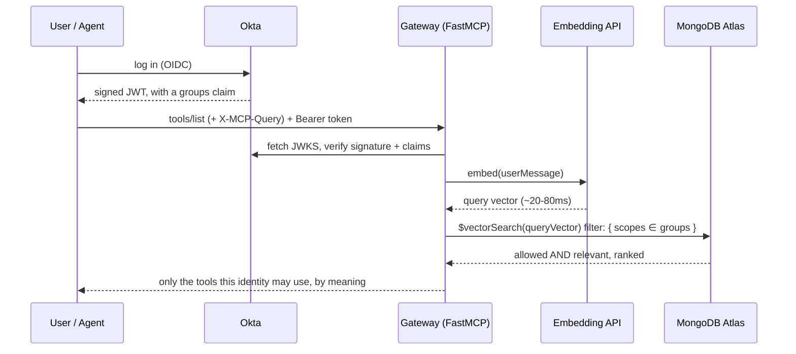
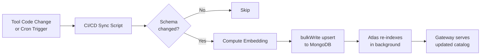

# Productionizing the MCP Gateway: Identity, Resiliency, and the Levers Beyond Retrieval

> **TL;DR:** MCP servers inject their *entire* tool catalog into the model on every turn — tens of thousands of tokens before the agent does anything useful. The base fix is to treat tool selection as a *retrieval* problem: embed the catalog once and hand back only the tools a task needs (~8.8x fewer tokens in our benchmark, no tool text touched). This post is the production layer on top of that: bind tool scope to *verified* identity with Okta, survive flaky downstreams, keep the catalog fresh off the hot path, and stack accuracy levers beyond plain retrieval — all on MongoDB Atlas as a single control plane, because the catalog, embeddings, audit trail, and analytics are just documents on one engine. Everything here is *additive*; none of it brings back the hand-maintained routing table.

Quick context if you're new to this layer: the Model Context Protocol (MCP) is the emerging standard for connecting AI agents to external tools — an MCP *gateway* sits between the agent and those tools, deciding which ones to expose on each turn. The problem starts there.

An MCP server's most expensive habit is handing an agent its *entire* tool catalog on every turn — tens of thousands of tokens of schema and descriptions injected before the model does a single useful thing. The fix this post builds on is to treat tool selection as a *retrieval* problem: embed the catalog once, and hand back only the handful of tools a task actually needs. Pointed at the real GitHub MCP server, that cuts the per-turn token bill by roughly an order of magnitude (~8.8x in our benchmark) **without touching a single tool's text**.

MongoDB turns out to be the natural home for it. The catalog, the embeddings, the audit trail, and the analytics are all just documents on one engine.

That's the premise: a lean gateway that routes by meaning. The headline deserved a clean experiment, not a pile of caveats — so this post picks up the questions you ask *the morning after you're convinced it works*:

- How do I scope tools to *who's asking*, not just *what's being asked*?
- What happens when a downstream server hangs, crashes, or returns garbage?
- How does the catalog stay fresh without tanking the hot path?
- And how far past "route by meaning" can this design actually go?

None of this changes that core idea — it builds on top of it. Everything below is *additive*: each piece either makes the gateway safer, more reliable, or more accurate, and none of it reintroduces the hand-maintained routing table we were so glad to delete. Here's the production layer.

---

## 1. Identity-bound scope: routing to *who's asking*, with Okta

The gateway routes purely by *meaning* — the only header is the task itself (`X-MCP-Query`), and it hands back the most relevant tools with no notion of who's asking. That's the right default. It's deliberately not an authorization model. But in an enterprise you often *also* want a hard boundary: not just the most *relevant* tools, but only the tools this identity is *allowed* to invoke at all.

That boundary must come from *verified* identity, never a self-asserted header. "Trust the client to tell you its own permissions" is how you end up in an incident review. The clean way to add it is a metadata `filter` on the *same* `$vectorSearch` query: identity narrows the candidate set, meaning still ranks it. Here's how that wiring looks with Okta, and how to stand it up locally. None of it changes the routing — it only adds a filter in front of it.

### The shape of it

The sequence below traces a single `tools/list` call end to end. The detail worth watching: the gateway verifies the token and turns its `groups` claim into a `$vectorSearch` filter *before* the embedding ranking runs — identity narrows the candidate set, and only then does meaning rank what's left.



Okta authenticates the human (or the service account) and mints a signed JWT whose `groups` claim says, for example, `["pulls", "issues"]`. The gateway turns that *verified* claim — not a header — into a filter on the vector query, so the embedding ranking only ever sees tools this identity is entitled to.

### Step 1: Validate Okta tokens in the gateway

> *A note on versions:* the Python snippets in this post were written against **FastMCP 3.x** and the **2025-06-18 MCP spec revision**. This layer of the API moves fast — the auth-provider import paths and middleware hooks in particular have churned between minor releases — so if a symbol has moved by the time you read this, check the [FastMCP changelog](https://github.com/jlowin/fastmcp) and the [MCP spec](https://modelcontextprotocol.io/specification) for the current equivalent. The *shape* of the approach (verify the token, derive a filter, push it into the vector query) is stable even when the exact API surface isn't.

FastMCP has first-class token verification. Point it at your Okta org's JWKS and the gateway will reject anything that isn't a valid, unexpired, correctly-scoped Okta token before a single line of our middleware runs:

```python
from fastmcp import FastMCP
from fastmcp.server.auth.providers.jwt import JWTVerifier

# Okta's built-in "default" authorization server
verifier = JWTVerifier(
    jwks_uri="https://<your-org>.okta.com/oauth2/default/v1/keys",
    issuer="https://<your-org>.okta.com/oauth2/default",
    audience="api://default",
)

mcp = FastMCP("Lean-MCP-Gateway", auth=verifier)
```

That's the one line that changes in `build_mcp_server()`. If you prefer config over code, the same thing is pure environment: `FASTMCP_SERVER_AUTH=fastmcp.server.auth.providers.jwt.JWTVerifier` plus `FASTMCP_SERVER_AUTH_JWT_JWKS_URI`, `_ISSUER`, and `_AUDIENCE`. For Okta tokens issued as opaque strings rather than JWTs, swap `JWTVerifier` for `IntrospectionTokenVerifier`; for a browser login flow where the client doesn't already hold a token, `OAuthProxy` / `OIDCProxy` front Okta (which doesn't do Dynamic Client Registration) with a pre-registered client. Same destination, different amount of help from the server.

### Step 2: Turn the verified claim into a search filter

The current `SemanticFilterMiddleware` runs `search_tools(query)` with no filter. The production version reads the token the verifier already validated and passes the caller's groups straight into the retrieval as an allowed-scope filter — adding a `scopes` metadata field to each catalog document is the only schema change:

```python
from fastmcp.server.dependencies import get_access_token

def caller_scopes() -> list[str] | None:
    token = get_access_token()                  # the validated Okta token, or None
    return (token.claims.get("groups") if token else None) or None

# inside on_list_tools, instead of search_tools(query, k=...):
scopes = caller_scopes()
ranked = await search_tools(query, k=cfg.route_top_k, allowed_scopes=scopes)
```

The crucial property: the same filter is applied on the call path, so a member of the `readonly` group can't invoke a tool outside its scope even if it hand-crafts the call — the verified token simply doesn't carry the scope, the tool never becomes a candidate, the call comes back "tool not found," and the attempt is audited. This is *additive* to the safety floor (which still hides destructive tools from everyone) and, crucially, it's **not** a hardcoded routing table — the scope comes from a verified identity, and meaning still does the ranking.

### Step 3: Where MongoDB Atlas quietly does the heavy lifting

Here's the part that's easy to miss. Once identity decides *what a caller is allowed to see*, you still have to decide *which of those tools is right for this request*. You want both in one motion — otherwise you've reintroduced the very fan-out we set out to kill.

Atlas does it in a single query. The caller's scope is just *metadata*. The relevance is just a *vector*. Atlas Vector Search filters on the former while ranking on the latter, in the same operation.

Each tool document in the catalog looks like this (the embedding width just tracks your model — the shipped demo uses a local 768-dim `nomic-embed-text`; a production deployment often swaps in a hosted 1536-dim model, shown here):

```json
{
  "name": "github_pulls",
  "description": "List and filter pull requests for a repository",
  "scopes": ["pulls", "readonly"],
  "embedding": [0.0231, -0.0142, 0.0087, "… 1536 dims (hosted model)"]
}
```

The `scopes` array is the only schema addition — it maps directly to the Okta `groups` claim. When the gateway queries, the filter and the ranking happen together:

```js
db.tools.aggregate([
  { $vectorSearch: {
      index: "tools_vector",
      path: "embedding",
      // embed() here represents your application layer calling an embedding API
      // (like OpenAI) and passing the resulting float array into the query.
      queryVector: embed(userMessage),
      filter: { scopes: { $in: callerGroupsFromOktaToken } },  // scope = metadata
      numCandidates: 100,
      limit: 3
  }}
])
```

A tool the caller isn't entitled to never even becomes a candidate — the metadata filter removes it *before* the semantic ranking runs. There's no second system to keep in sync, no search index that doesn't know about permissions, no race between the authz store and the vector store.

**A note on that `embed()` call.** Yes — embedding the user's query is a synchronous network hop on the hot path, unlike catalog embeddings which are computed offline (Section 4). In practice this is ~20–80ms to a colocated embedding endpoint (OpenAI, Voyage, or a self-hosted model), which is well under the latency floor of the downstream tool call it gates. If that still bothers you: cache embeddings for repeated queries, use a local embedding model to eliminate the hop entirely, or batch multiple routing decisions in a single embed call when the agent sends a multi-step plan. The important thing is that it's a *single* fast call that replaces injecting the full catalog — the tradeoff is 50ms of latency versus 20,000 tokens of context waste on every turn.

Identity-derived scope, tool metadata, and semantic meaning live in one place and get evaluated together. That combination — fine-grained metadata filtering and vector similarity in a single query, on a single platform — is the unglamorous reason this layer sits so naturally on Atlas.

### Doing it locally

You don't need a production tenant to build this:

- **With a free Okta developer org** (the realistic path): create an org at `developer.okta.com`, add an OIDC app, and under the `default` authorization server add a `groups` claim to the access token. Create groups that match your tools' `scopes` field — say `pulls`, `issues`, and a read-only `readonly` — assign your test user, and point the gateway's `JWKS_URI` / `ISSUER` at that org. The gateway still runs on `localhost`; it just validates tokens minted by Okta. Grab a token (Okta CLI or a quick auth-code flow) and call the gateway:

```bash
curl -H "Authorization: Bearer $OKTA_TOKEN" http://localhost:8000/mcp/ ...
```

- **Fully offline** (for iterating on the scope logic with no network at all): point `JWTVerifier` at a local JWKS and mint your own RS256 tokens with whatever `groups` claim you want to test. The gateway can't tell the difference — it's verifying signatures and claims either way — so you can develop the entire identity-to-scope mapping on a plane.

- **For `$vectorSearch` locally:** Atlas Vector Search requires an Atlas cluster (a free M0 tier works), but for pure unit testing you can stub the retrieval layer with a simple cosine-similarity function over a small in-memory array of pre-computed embeddings — the gateway's `search_tools()` is the only call site to swap.

---

## 2. One control plane, not four: the unified-platform pattern

When building gateways—whether for microservices a decade ago or for MCP tools today—architects inevitably face a fragmentation problem. To govern a distributed ecosystem safely and efficiently, an infrastructural control plane must handle four distinct operational workloads:

1. **Registry:** Knowing what capabilities exist and what their interfaces look like.
2. **Config:** Defining access policies, routing logic, environments, and feature flags.
3. **Search:** Dynamically retrieving a subset of capabilities based on arbitrary inputs.
4. **Analytics:** Observing system health, token usage, performance, and failure rates.

In a traditional architecture, each of these four becomes its own system. The real cost isn't any single one of them — it's the connective tissue between them: the sync jobs, the duplicated copies, the four mental models a team has to hold at once.

What's worth pausing on is *why* they can collapse at all. A tool's registry entry, the config attached to it, the index you search it by, and the telemetry it emits are not four kinds of data. They are all just documents. The fragmentation was never inherent to the problem — it was an artifact of storing one shape of data across four engines that each understood only a slice of it.

### The architecture shift: fractured vs. unified

| Operational Need | Traditional Fractured Stack | The MongoDB Unified Approach |
| --- | --- | --- |
| **1. Registry** | Relational DB (PostgreSQL / MySQL) | Document Store (BSON Catalog) |
| **2. Config** | Key-Value Store / Config Service (Consul / Redis) | Document Store (Embedded Metadata/Policies) |
| **3. Search** | Search Engine + Vector DB (Elasticsearch + Pinecone) | Atlas Search + Atlas Vector Search (Same Nodes) |
| **4. Analytics** | Time-Series / Data Warehouse (ClickHouse / Snowflake) | Live Aggregation Engine (Time-Series Collections) |
| **Operational Surface** | 4+ systems, each with its own scaling, backup, and access model — kept consistent by sync jobs that can drift | One system's scaling, backup, and access model — and no second store to reconcile |

Collapse those four engines back into the one data model they always shared, and the payoff isn't a feature you bought — it's surface area you no longer have to operate. One thing to scale, back up, secure, and reason about, instead of four held in uneasy sync. A control plane with fewer moving parts has less that can quietly drift out from under it, and that — more than any single capability on the list — is the honest reason this layer wants to sit on one foundation rather than four.

---

## 3. Resiliency: surviving a flaky downstream

Proxying introduces the cold, hard reality of the fallible network. If a downstream MCP server hangs, crashes, or returns corrupt payloads, the gateway cannot allow those failures to cascade and freeze the agent.

* **Enforced Deadlines:** The gateway wraps all downstream JSON-RPC requests in a strict async timeout (defaulting to **2,000ms**). If a downstream server stalls, the gateway aggressively cuts the cord rather than letting the LLM client sit in limbo.
* **Protocol-Safe Failure Wrapping:** When a downstream server throws an unhandled exception or sends a malformed response, the gateway's middleware catches it at the boundary. The failure is recorded in the MongoDB `invocation_audit` collection for debugging, and then cleanly translated into a standard MCP error frame (e.g., JSON-RPC code `-32603` for Internal Error).
* **Informing the Brain:** Instead of dropping the connection or throwing a generic HTTP 500, the gateway returns a structured error message directly to the agent (e.g., `{"error": "Tool 'actions_get' timed out after 2000ms"}`). This keeps the session alive and hands the context back to the LLM, allowing it to gracefully retry, pivot to an alternative tool, or explain the system outage to the user.

---

## 4. Keeping the catalog fresh: the mutation lifecycle

If tool definitions change frequently, computing embeddings on the hot path is how you tank your latency. The fix: decouple mutation from serving entirely.



The catalog uses a deployment-driven mutation lifecycle — changes flow through offline, never on the request path:

* **The CI/CD Sync Script:** For homegrown tools, discovery happens during the build phase — typically a step in your existing pipeline (a GitHub Actions job on merge to `main`, a GitLab CI stage, or a Jenkins post-build hook) that runs the sync before deploy. For third-party downstream servers whose schemas change on someone else's schedule, the same logic runs as a standalone worker — a small always-on service or a scheduled job (Actions `schedule:` cron, a Kubernetes `CronJob`, or a Lambda on an EventBridge timer) — that polls their `tools/list` endpoints periodically. Either way it lives *outside* the gateway process, so a re-embed never blocks a request.
* **Differential Hashing:** The sync script introspects the available tools and generates a hash of their schemas. If the tool's name, description, and parameters haven't changed, the update is skipped entirely.
* **Idempotent Bulk Upserts:** When a change *is* detected, the script calls the embedding API to generate a fresh vector for the updated description, packages the metadata, and executes an idempotent `bulkWrite()` upsert into MongoDB.
* **Zero-Downtime Indexing:** Atlas Search and Vector Search index updates happen asynchronously in the background. The gateway continues serving the old schemas until the new documents land. Zero application downtime, zero hot-path overhead.

---

## 5. Beyond retrieval: the levers that narrow failure further

Routing by meaning is the *floor* of this design, not the ceiling. It already turns a ~21,830-token firehose into a ~2,480-token shortlist — with every tool's text intact. But two failure modes survive that win: the model can still *pick the wrong tool* out of a noisy shortlist, and a caller can still *see a tool they shouldn't*.

Both are addressable. **Every lever below either makes the model more accurate or shrinks the handoff further — and most do both at once.** None reintroduce the brittle, hand-maintained policy we deleted; each is either *derived by the system* or *learned from data*. They stack cleanly on top of retrieval.

### High-impact levers

**1. Add a lexical arm, then re-rank.** Fuse a keyword `$search` with `$rankFusion` alongside the vector query — both over the same documents — so half-keyword, half-vibe queries don't slip through a purely semantic net. Then reorder the shortlist with a richer pass (cross-encoder or small LLM scoring by task-fit). Affordable because it runs over ~20 candidates, never nine hundred.

**2. Close the loop with the audit trail.** Every routing decision — query, tools returned, tool picked, call outcome — is already recorded in MongoDB. That's a labeled dataset, not just forensics. Queries that routed wrong become regression cases. Descriptions that mislead get rewritten. The catalog improves with use, no model retraining required.

### Additional levers (diminishing returns, increasing specificity)

| Lever | Core idea | When it matters |
| --- | --- | --- |
| **Derive scope from identity** | Pass a verified claim (Okta `groups`, agent role) as a metadata filter on `$vectorSearch`. A tool the filter removes can never be ranked, picked, or hallucinated. | Already covered in Section 1 — listed here for completeness. |
| **Confidence-aware k** | Make top-k a function of retrieval confidence: a single-tool task gets `k=3`; a broad query gets more headroom. | When you have enough audit data to calibrate thresholds. |
| **Retriever abstention** | When the top similarity score is weak or the gap between #1 and #2 is razor-thin, shrink the list or return "did you mean…?" instead of guessing. | High-stakes environments where a wrong tool is worse than no tool. |
| **Corpus normalization** | Augment vague upstream descriptions with a synthetic *"use this when…"* line before embedding. Better inputs > better knobs. | Large third-party catalogs with inconsistent naming. |

Stacked, these turn *"probably the right tools"* into *"demonstrably the right tools, and only the ones this identity may use."* The throughline: the protocol was never the problem, and the fix is never one clever trick. It's a short stack of boring, composable levers — queries and metadata over data you already keep in one place.

---

## 6. The wider toolkit: how the ecosystem is fighting bloat

We arrived at "treat tool selection as retrieval" from our own token bill, but it's worth stepping back to see the whole field at once, because the fixes sort cleanly into the two halves of the bloat problem — *input* (schema) bloat, the catalog handed over before anything runs, and *output* (response) bloat, the raw payload dumped back after a tool runs. Here's the landscape, and where this gateway sits in it.

**Progressive disclosure / dynamic tool search (input).** Anthropic's Claude Code attacks schema bloat right inside the CLI: rather than loading every tool definition at startup, it loads detail *as needed* — a table of contents first, the detailed appendices only when the agent reaches for them. That on-demand discovery is what lets multi-hour autonomous workflows run without the catalog throttling the context window (and, by Anthropic's own report, cut a 50+-tool library from ~72k tokens to ~8.7k — an order-of-magnitude drop, the same shape as the retrieval win this whole approach is built on). The principle is laid out nicely in musistudio's write-up [*"Progressive Disclosure of Agent Tools from the Perspective of CLI Tool Style"*](https://github.com/musistudio/claude-code-router/blob/main/blog/en/progressive-disclosure-of-agent-tools-from-the-perspective-of-cli-tool-style.md), with a [short video walkthrough](https://www.youtube.com/watch?v=DQHFow2NoQc) of how it scales without overloading the window.

**Proxy compressors (input).** Atlassian's open-source [`mcp-compressor`](https://www.atlassian.com/blog/development/mcp-compression-preventing-tool-bloat-in-ai-agents) wraps verbose, enterprise-scale toolsets (Jira, Confluence) and reports a **70–97%** cut in tool-description overhead. The mechanism is exactly the "collapse the catalog to two operations" idea Layered Systems describes: it replaces a server's entire inventory with two generic wrappers — `get_tool_schema` and `invoke_tool` — and expands an individual tool's full schema *only* when the model explicitly asks for it (which, as a bonus, stabilizes prompt caching across turns). That is the same move this gateway makes, one layer up: advertise a curated, task-scoped view and hydrate detail on demand instead of dumping the whole binder.

**Protocol-level lazy hydration (input).** The same instinct is being pushed back into the spec. Alongside the SEP-1576 / SEP-1881 proposals, GitHub Issue [#1978, *"Proposal: Lazy Tool Hydration for Large Tool Sets,"*](https://github.com/modelcontextprotocol/modelcontextprotocol/issues/1978) is the most concrete: a `minimal` flag on tool listing (return only names and summaries) plus a targeted `tools/get_schema` method to fetch full definitions on demand — a measured **91%** token reduction at the protocol layer. It's the standardized cousin of what proxies like `mcp-compressor` and gateways like this one already do by hand.

**Managed gateway semantic search (input).** The cloud platforms are now turning this into a product feature, not a pattern you hand-roll. AWS's Bedrock AgentCore Gateway offers opt-in semantic search over your registered tools: enable it at gateway creation and the agent calls a single built-in tool, [`x_amz_bedrock_agentcore_search`](https://docs.aws.amazon.com/bedrock-agentcore/latest/devguide/gateway-using-mcp-semantic-search.html), with a natural-language query to retrieve only the tools relevant to the task — in AWS's own words, "particularly useful when you have many tools and need to find the most appropriate ones for your use case." That is precisely the move this gateway makes — embed the catalog, route by meaning, hand back a shortlist — offered as managed infrastructure rather than rolled by hand. When the largest cloud vendor turns "treat tool selection as retrieval" into a checkbox, the pattern has stopped being a clever workaround and become the default shape of a serious gateway.

**Code Mode / sandboxed execution (output).** This is the one fix aimed at the *other* half — response bloat: StackOne, Cloudflare, and Block's *Goose* have the model write a script that filters data inside a sandbox and return only the distilled answer (StackOne's 14k → ~500 tokens, ~96%). It's the natural complement to retrieval — retrieval keeps the tool list lean on the way in; Code Mode keeps the payload lean on the way out.

The common thread — and the closing point — is **curated context**. Whether it's semantic-search routing, a proxy compressor, protocol-level lazy loading, or a code sandbox, the goal is identical: the model sees the exact tool it needs, and the exact data it needs, at the exact moment of execution. Context windows keep growing; keeping them *clean* is the durable engineering advantage. (For the broader "is MCP even the right tool?" version of this argument, Zero-Shot Labs' [*"The REST API That Is Enough"*](https://zeroshotlabs.se/en/posts/mcp-vs-rest/) — where the term "token bloat" comes from — is the sharpest read.)

---

## Where this leaves us

MCP isn't a fad you can wait out. It's becoming the default way models reach tools, and the teams who do well with it will be the ones who treated *this* layer — verified identity in, scoped and semantically-routed tools out — as a first-class system early, rather than bolting it on after the token bills and the security review arrive.

The pleasant surprise was how little had to be invented. The protocol is FastMCP's job. The identity is Okta's job. And the part in the middle — store the catalog, enforce the scope, rank by meaning, keep the receipts — turned out to be one platform's job, not four. (This mirrors the spec's own **SEP-1881**, "scope-filtered discovery.")

Context windows will keep growing. The teams that win won't be the ones who fill them — they'll be the ones who keep them *clean*. That's a data problem, not an infrastructure problem. And data problems want one home, not four.

Scope is metadata. Relevance is a vector. Resiliency is middleware. Freshness is a bulk upsert. The audit trail is a labeled dataset you were already keeping. Same documents, same database, the whole way up.

---

## Further reading

The sources behind the claims here are linked inline — most usefully Atlassian's open-source [`mcp-compressor`](https://www.atlassian.com/blog/development/mcp-compression-preventing-tool-bloat-in-ai-agents), musistudio's [progressive-disclosure write-up](https://github.com/musistudio/claude-code-router/blob/main/blog/en/progressive-disclosure-of-agent-tools-from-the-perspective-of-cli-tool-style.md), StackOne's [Code Mode](https://www.stackone.com/blog/mcp-code-mode-agent-context-architecture/), AWS's [Bedrock AgentCore Gateway semantic tool search](https://docs.aws.amazon.com/bedrock-agentcore/latest/devguide/gateway-using-mcp-semantic-search.html), and Zero-Shot Labs' [*"The REST API That Is Enough"*](https://zeroshotlabs.se/en/posts/mcp-vs-rest/). The spec proposals referenced inline — **SEP-1576** (embedding-based tool selection), **SEP-1881** (scope-filtered discovery), and the kindred GitHub Issue **#1978** ([*"Lazy Tool Hydration"*](https://github.com/modelcontextprotocol/modelcontextprotocol/issues/1978)) — are tracked as open proposals in the Model Context Protocol repository.
