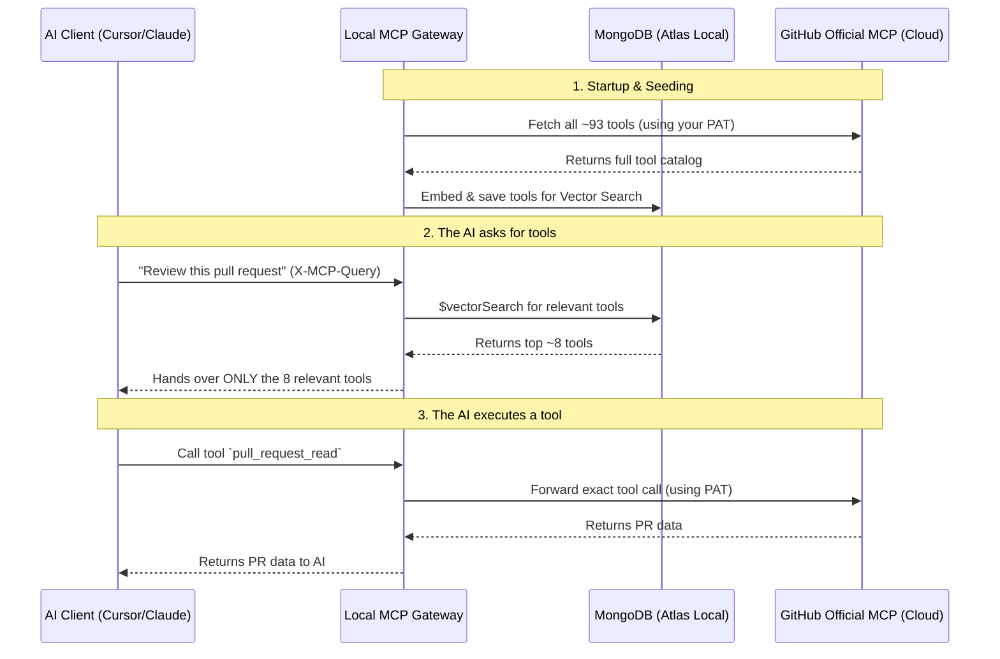

# The Magic Behind the Scenes

When you first look at this project, a common question is: *"Wait, do I need to host a GitHub MCP server myself? Where do the actual tools come from?"*

The short answer is **no**. You do not need to host the GitHub MCP server. 

GitHub hosts a central, public MCP server in the cloud. This project is just a **"smart bouncer"** that sits between your AI and GitHub's official server.

Here is a breakdown of how the magic actually works.

## The Architecture

## Step-by-Step Breakdown

### 1. The Central Server (Cloud)
GitHub officially hosts an MCP server at `https://api.githubcopilot.com/mcp/x/all`. This server contains the logic for reading pull requests, listing actions, searching code, etc. You don't run this code; GitHub does.

### 2. Authentication (Your PAT)
When your local gateway starts up, it makes an HTTP request to GitHub's cloud server. It takes the `GITHUB_PAT` you put in your `.env` file and attaches it as an `Authorization: Bearer ...` header. *(Note: Ensure your PAT has the appropriate read/write scopes for the repositories you want the AI to interact with. A read-only token works for the demo, but executing actions requires write access).*

GitHub looks at this token and says:
1. *"Who does this token belong to?"*
2. *"What repositories do they have access to?"*
3. *"What scopes did they grant this token?"*

*(What if GitHub is down during a local restart? Don't worry. The gateway saves the tool catalog and embeddings in MongoDB. On restart, it just reuses the cached MongoDB data so startup is instant and resilient).*

### 3. The Smart Filter (The Magic)
GitHub's server returns a massive list of ~93 tools. If we gave all 93 tools to the AI on every single turn, it would waste a huge amount of tokens and slow the AI down.

Instead, the gateway takes your task (e.g., *"review this pull request"*) and asks the local MongoDB Vector Search: *"Which of these 93 tools actually matter for this specific task?"*

MongoDB does the vector math and returns just the ~8 relevant tools. The gateway hands *only* those 8 tools to the AI. The tool descriptions are **byte-for-byte identical** to what GitHub provided—we just hide the remaining ~85 tools the AI doesn't need right now (these numbers stay dynamic as GitHub adds or removes tools!).

### 4. Execution
When the AI decides to actually *run* one of those tools, the gateway doesn't execute it locally. It forwards that exact command straight back to the official GitHub MCP server. GitHub performs the action as *you* (using your PAT), and the gateway passes the real result back to the AI.

## The Safety Floor (the bouncer's blocklist)

There's one thing the bouncer does *without* being asked, and it's the only hand-written rule in the whole gateway: it refuses to let **destructive** tools through the door — in **both** directions.

GitHub's catalog includes tools that can permanently destroy things (e.g. `delete_file`, anything the upstream itself flags as `destructiveHint`). The safety floor strips those out:

- They never appear in the tool list the AI sees (`tools/list`).
- They can't be called by name either (`tools/call`) — even if the AI already knows the name, the gateway answers "no such tool."

Because the semantic search index is built from the *already-floored* list, a destructive tool is never even embedded — so a clever request like *"clean up the repo"* can't surface `delete_repository`. It's a **guardrail** (*what is unsafe?*), not an authorization system (*who is this caller?*).

### How does it know a tool is destructive?

It uses GitHub's own labels — and *only* those labels:

1. If GitHub marks a tool **read-only** (`readOnlyHint`), it's always allowed — it can't destroy anything.
2. If GitHub marks it **destructive** (`destructiveHint`), it's blocked — in both directions.
3. If GitHub gives *no* label, the gateway takes the tool at face value and leaves it alone. It does **not** guess from the name. (GitHub flags `delete_file` as `destructiveHint`, so it's caught — but it leaves `label_write` and `manage_notification_subscription`, both of which can *delete*, unlabeled. A name-matching trick would miss those too, which is exactly why annotating for risk is the **server author's** job, not the gateway's job to guess.)

### How to tune the floor

It all lives in `is_destructive()` in `app/gateway/github_proxy.py` — which reads the upstream's annotations and nothing else:

- **Toggle the whole floor:** set `MCPX_BLOCK_DESTRUCTIVE=false` to disable it (default is on).
- **Go further upstream:** set `MCPX_GITHUB_READONLY=true` to ask GitHub for a read-only catalog, so write/destructive tools never even reach the gateway.
- **Cover a missed tool:** the durable fix is upstream — get the tool annotated `destructiveHint`. The gateway keeps no name list of its own.

You can see exactly what's blocked on the live dashboard's **"Safety floor"** panel (served by `GET /demo/safety`).

## Summary
The database is *only* used as a semantic search engine to figure out which tools to show the LLM. The tools themselves, and the execution of those tools, are 100% official GitHub. And the safety floor guarantees the genuinely destructive tools are never on the table to begin with.