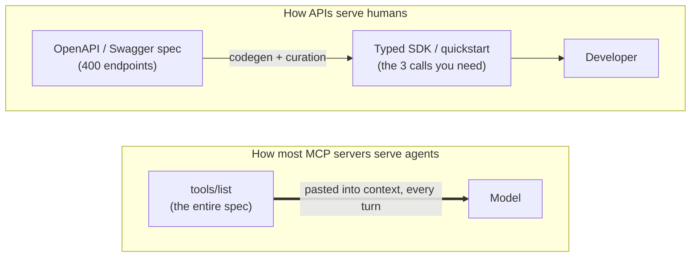
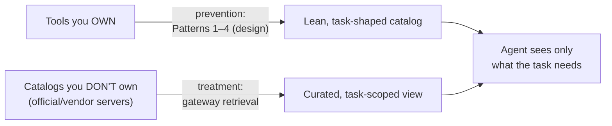

# MCP Design Patterns: The Protocol Was Never the Problem

> **TL;DR:** An MCP server's tool list is, functionally, an OpenAPI/Swagger spec injected straight into the model's context — and "the official server for X" usually means "the entire spec, every turn." We learned decades ago not to hand a consumer the raw spec; we curate SDKs, design resources, and version surfaces. MCP quietly collapsed that discipline by making the *reference document* the *runtime interface*. The fix isn't a new protocol — it's old design discipline (task-shaped tools, lean schemas, curated catalogs) plus one infrastructural move: treat tool discovery as a search problem and put the catalog, the routing, the analytics, and the audit trail on a single substrate that can also *encrypt the sensitive parts in place*.

MCP is taking a beating in engineering circles right now, and most of the complaints are aimed at the wrong target. The protocol isn't the problem. *How we design servers on top of it* is. This is an opinionated field guide to two decisions almost nobody makes deliberately: **when an MCP server is even the right tool, and — once it is — how to shape a catalog that doesn't drown the model.**

---

## The parallel nobody says out loud: a tool list is a Swagger doc

Here's the framing that reorganizes the entire debate. Strip away the JSON-RPC envelope and ask what an MCP server actually *hands* a model on connect: a list of operations, each with a name, a human-readable description, and a typed parameter schema. That is an **OpenAPI/Swagger document**. Not "like" one — structurally the same artifact: a machine-readable catalog of every callable operation and its input shape.

There's an analogy worth keeping in your head for the rest of this: imagine walking into a coffee shop and, before you can say "flat white," the barista hands you a 500-page binder of every bean they've ever sourced and says "read this first, then order." That's what a kitchen-sink MCP server does to a model on connect — and the technical version is precise: **it's pasting your entire Swagger spec into the prompt and asking the model to pick an endpoint.** Tens of thousands of tokens of reference material, injected before the agent does a single useful thing, every turn.

We would never do this to a *human* consumer of an API, and the reason is worth saying slowly, because it's the whole point:

> An OpenAPI spec is **reference material**, not an **interface**.

We generate typed SDKs from it. We write curated quickstarts on top of it. We build docs portals that show you the three endpoints you need, not all four hundred. The spec is the source of truth that *sits behind* the interface a developer actually holds — it is almost never the thing you consume directly. A developer who learns Stripe doesn't read `openapi.json`; they `import stripe` and call `stripe.charges.create()`. The curation between the spec and the call is the entire value of good API design.

MCP, as most servers implement it today, **deleted that layer.** The reference document *is* the runtime interface. The model gets the raw spec and is expected to do, on every turn, the curation work that an SDK author, a docs team, and an API design review normally do once. Jeremiah Lowin — the creator of FastMCP — drew exactly this line: *"An API that is 'sophisticated' for a human is one with rich, composable, atomic parts. An API that is 'sophisticated' for an agent is one that is ruthlessly curated and minimalist."* The raw spec is the former. The model needs the latter.



The top row is fifteen years of hard-won API design discipline. The bottom row is what "just expose it over MCP" actually does. The protocol didn't force the bottom row — *a design choice did.* Everything below is about making the bottom row look like the top one.

---

## Why the "official" servers are the worst offenders

MCP is getting a bad rap right now, and the loudest evidence is always the same: a flagship vendor's "official MCP server" that injects 40k–55k tokens of schema before the model reads a line of your actual problem. Simon Willison [clocked the official GitHub server at ~55,000 tokens][willison] just to describe its 93 tools; Layered Systems found a [MySQL server shipping 106 tools as ~54,600 tokens on every initialization][layered]. The instinct is to blame the protocol. That's the wrong defendant.

The "official" servers are the worst offenders for a reason that has nothing to do with MCP and everything to do with incentives. A vendor shipping *the* server for their product is optimizing for **coverage**, not curation: every endpoint mapped to a tool, every parameter documented, nothing left out — because "we don't support X over MCP" is a worse headline than "our server is verbose." Comprehensive is the right call for a docs portal a human browses. It is exactly the wrong call for a context window, where every tool you *could* expose is rent you pay on every turn whether the task touches it or not. The kitchen-sink server is a Swagger dump wearing a protocol hat.

The cleanest way to see that this is a *design* failure and not a *protocol* failure is Layered Systems' three-layer split of where tokens actually leak — the **server** (how verbose are your schemas?), the **protocol** (does MCP even allow lazy discovery?), and the **host** (does it forward every tool to the model?). Line the famous complaints up against those three columns and the protocol column comes back conspicuously empty:

| The complaint | Whose design choice it actually is | The protocol's fault? |
| --- | --- | --- |
| 55k tokens of schema for one server | **server author** — an uncurated, coverage-maximizing catalog | No |
| Every tool injected on every turn | **host** — it forwards the whole list | No |
| Wrapping a CLI that already exists | **server author** — wrapped what didn't need wrapping | No |
| "Static catalogs don't scale" | **host + server** — no dynamic discovery offered | No |

Nothing in the MCP spec says you must hand over the whole binder. `tools/list` is a request the server *answers however it wants* — it can answer with three tools or three hundred, scoped to the caller or identical for everyone. The servers that hurt chose "three hundred, identical, every time." That's a sentence about design, not about JSON-RPC. So the rest of this post is the design manual the kitchen-sink servers skipped.

---

## Pattern 1: Design task-shaped tools, not resource-shaped ones

The single most consequential design decision is what a "tool" *is*. The kitchen-sink reflex maps tools one-to-one onto API resources and verbs: `create_issue`, `get_issue`, `update_issue`, `list_issues`, `add_label`, `remove_label`, `assign_issue`… That's the **resource-shaped** catalog. It's a faithful mirror of your REST surface, and it's exactly the wrong shape for an agent, because it forces the model to do the assembly work — discover six tools, chain them in the right order, and not fumble the state in between.

A **task-shaped** tool is built around an *intent the agent actually forms*: `triage_issue`, `review_pull_request`. One tool maps to one decision the model makes, with parameters that correspond to choices a human would make about that task — not to the columns of your database table. This is Lowin's "curate, don't convert" stated as a rule: **design around what the agent wants to accomplish, not around how your API happens to be partitioned.** The resource-shaped catalog is what you get when you run a Swagger-to-MCP converter and ship the output. The task-shaped catalog is what you get when someone asks "what is the agent actually trying to do here?" first.

This isn't a license to merge everything into one tool — that's the opposite failure (Pattern 2). It's a license to delete the tools that only exist because your REST API needed them for CRUD symmetry, and to name the survivors after goals.

## Pattern 2: Find the granularity Goldilocks zone

Granularity is the lever that controls token bloat *before* any gateway gets involved, and it cuts both ways.

**Too fine** is the resource-CRUD explosion from Pattern 1: a resource × verb matrix that produces N×M tools. The catalog balloons, *and* — the second-order cost everyone forgets — the model has to chain many calls to get anything done, which multiplies turns, inflates the *output* side of the bill, and creates more opportunities to pick the wrong tool from a crowded list.

**Too coarse** is the equal-and-opposite mistake: collapse everything into one mega-tool with a `mode`/`action` switch and a union of forty optional parameters. `github(action, ...)`. Now the single tool's schema is enormous, the model can't tell which parameters are valid for which `action`, and your validation is mush. You didn't remove the bloat; you relocated it into one unreadable tool and threw away type safety on the way.

The sweet spot is one tool per coherent task, with a parameter set small enough that every field is relevant on every call. The way to *feel* the cost is to put a price on it. Measured with the `cl100k_base` tokenizer, the real GitHub MCP server's catalog runs ~21,830 tokens across 93 tools — roughly **~235 tokens per tool** (Willison's higher count puts it nearer ~590). That per-tool figure is your unit price, and the bill is multiplicative:

```text
per-turn input cost  ≈  (tokens per tool)  ×  (tools exposed)  ×  (turns)
                          ▲ Patterns 2 & 3     ▲ Patterns 1 & 2     
                                               + the gateway shrinks this factor
```

Granularity drives the first two factors at once. Halving a sprawling catalog *and* trimming each surviving tool's schema is a compounding win — before retrieval ever enters the picture.

## Pattern 3: Treat the schema as a token budget

Every word in a tool's name, description, and parameter docs is paid for on every turn it's exposed (in a raw server, that's *every* turn). So design the schema like you're paying per token, because the model is:

- **Descriptions are a capability line, not a manual.** One tight sentence saying *what the tool does and when to reach for it*. Move the prose, examples, and edge-case caveats out of the schema — the model needs to *route to* the tool, not read its reference docs inline. Don't restate types the JSON Schema already encodes.
- **Prune optional parameters ruthlessly.** Every optional field is permanent context cost for occasional benefit. If the agent needs it 5% of the time, consider a separate tool or a sensible default over a permanently-present knob.
- **Flatten the schema.** Deeply nested objects and sprawling `enum`s cost tokens and confuse routing. Shared `$ref` definitions help where the host expands them.
- **Name predictably.** Good namespaced names (`pulls.review`, not `doStuff`) carry meaning, which lets the description be shorter.

## Pattern 4: Design the output, not just the input

Token bloat has two faces, and tool *design* owns both. The input half is the schema (Patterns 2–3). The **output half** lands the instant a tool runs and dumps its raw payload — a giant CRM blob, a wall of telemetry — straight back into the context. A coarse tool that returns "everything it found" *forces* response bloat on the caller. A well-designed tool gives the model a way to ask for less: a `fields`/`select` parameter, pagination with `next_cursor`, and outputs that drop nulls, cap arrays, and truncate oversized strings while always leaving a `truncated` escape hatch. Design the return shape with the same discipline as the parameter shape; it's the same bill, billed on the way out.

### The patterns as a table

| Anti-pattern | Pattern | Why it matters |
| --- | --- | --- |
| Resource × verb CRUD matrix | One tool per **task/intent** | Fewer tools, fewer chained calls, fewer wrong picks |
| One mega-tool with a `mode` switch | Right-sized tools, every param relevant | Keeps schemas readable and type-safe |
| Description as a reference manual | Description as a **single capability line** | Cuts the per-tool token price (the ~235-tokens-per-tool lever) |
| Every optional param, always present | Prune; default; or split the tool | Optional knobs are permanent context rent |
| Return the full upstream payload | Field selection + pagination + compaction | Owns the *output* half of the bloat |

---

## Decide before you build: function calling vs. an MCP server

All four patterns above assume you've already decided to build an MCP server. That decision deserves its own scrutiny, because the most effective design pattern is sometimes *not building one*.

Here's the reframe that settles most of these arguments: **MCP is function calling promoted to a network protocol, with discovery, across a trust boundary.** A plain in-code function call and an MCP tool can invoke the exact same API; the difference is never capability. What MCP *adds* is reuse across many clients, language-agnostic interop, and a standard discovery handshake — and what it *costs* is a process to run and secure, a network hop, version compatibility across consumers, and the catalog-injection tax this whole series is about. You pay that tax to buy those three things. **If you're not buying any of them, you're paying tax for nothing** — which is precisely Brandon Dennis's warning that we "took function calls and turned them into network hops because the architecture diagram looked better."

So the decision isn't about what the tool *can do*; it's about *who consumes it and where the ownership boundary sits*. A promotion ladder, cheapest rung first:

| Your situation | Reach for | Why |
| --- | --- | --- |
| One app, one team, tools live in the agent's own codebase | **In-code function calling** | No protocol, no hop, expose per-call. You're buying none of MCP's three benefits. |
| The agent has a shell and the task is CLI-shaped | **Neither — use the CLI** | `gh pr view` is ~50 tokens the model already knows; an MCP wrapper is strictly worse — you've added latency and a tool catalog to buy back a capability the agent already had for free. |
| Many independent consumers, or you're crossing a team/org/trust boundary, or you need language-agnostic reuse | **An MCP server** | Now reuse, interop, and discovery are worth the tax. |
| You have a server and the catalog has outgrown hand-curation | **A gateway** (next section) | Curation by selection when you can't curate by hand. |

The decision axes underneath the ladder: **number of independent consumers** (one → function call; many → server), **ownership/trust boundary** (inside your codebase → function call; exposing to others → server), **surface stability** (small and stable → function-call it; large and evolving → discovery earns its keep), and **shell availability** (shell + CLI-shaped task → use the CLI, full stop). The honest punchline matches the rest of the series: most teams stand up an MCP server one consumer too early — the same reflex that wrapped `gh` and `kubectl` when those already existed.

---

## When you can't redesign the catalog: the gateway pattern

Patterns 1–4 are prevention. They work beautifully — *when you own the tools.* But the catalog that's actually wrecking your token budget is usually the one you *don't* own: the official GitHub server, the vendor's kitchen-sink integration, the third-party MCP endpoint you can't refactor. You can't task-shape someone else's 93 tools. Prevention isn't available; you need **treatment.**

The treatment is to stop thinking of tool selection as "load the catalog" and start thinking of it as what it actually is: **a search problem.** The agent doesn't need every tool. It needs the right two or three for what's happening right now. "Given a request, find the few most relevant items in a large collection" is one of the oldest problems in computing — retrieval. A gateway that sits in front of a bloated catalog, embeds it once, and returns only the handful a task needs is the curation Lowin prescribes, applied *by selection at serve time* instead of by hand at authoring time. It's the same move an SDK makes over a Swagger spec — surface the few operations this caller needs — except performed dynamically, by meaning, over a catalog you didn't write.

Point such a gateway at the real GitHub server, and the per-turn token bill drops by roughly an order of magnitude (~8.8x in a head-to-head against the raw catalog) **without editing a single tool's text** — same tools, same descriptions, just only the handful the task needs. Prevention and treatment compose cleanly — design your own tools well, and let the gateway forgive the catalogs you can't:



The design lesson hiding in the gateway is that **good API design and good tool discovery are the same discipline at two different times.** Design-time curation is an SDK; serve-time curation is a retrieval gateway. The kitchen-sink servers skipped both. You only need the second when you've been denied the first.

---

## Why tool discovery wants one substrate

Once you accept that discovery is a search problem, the natural next question is *where it runs* — and this is where most teams accidentally rebuild the fragmented stack. A tool-discovery layer needs four things done well, and the reflex is to buy a specialized box for each:

1. **Store the catalog** — tools, descriptions, scopes, config. (Reflex: Postgres or a config service.)
2. **Match by meaning** — embed the request, find the nearest tools. (Reflex: a vector DB — pgvector, Pinecone, Weaviate.)
3. **Match by keyword** — "refund" routes to billing, with typo tolerance. (Reflex: Elasticsearch / OpenSearch.)
4. **Analyze and audit** — token telemetry, which tools route, who called what. (Reflex: a warehouse + a separate log store.)

That's four engines, four query languages, four scaling stories — and, worst of all, four copies of the same tool document that you have to keep in sync. Every time a tool's description changes you're writing it to Postgres, re-embedding it into pgvector, re-indexing it in Elasticsearch, and hoping the warehouse's nightly batch agrees with all three. The connective tissue *is* the cost — the ETL pipelines you write and monitor, and the drift between stores that disagree the moment one falls behind. It shows up here in miniature the moment your catalog grows past a flat file.

The thing worth noticing is that **these aren't four kinds of data.** A tool's registry entry, the vector you search it by, the keyword index, and the telemetry it emits are all just *one document and operations over it*. The fragmentation was never inherent — it's an artifact of storing one shape across four engines that each understand only a slice. Collapse them back, and discovery runs on a single substrate:

| Discovery need | Bolt-on stack | MongoDB Atlas |
| --- | --- | --- |
| Catalog + config | Postgres / config service | The tool **is** a document; config sits next to it |
| Match by meaning | pgvector / Pinecone / Weaviate | `$vectorSearch` — embedding is just another field |
| Match by keyword | Elasticsearch / OpenSearch | Atlas Search (`$search`) — same documents, typo-tolerant |
| Both, fused | hand-tuned score blending across two stores | `$rankFusion` — reciprocal-rank fusion in one pipeline |
| Identity scoping | a separate authz table + a join | a `filter` on the *same* `$vectorSearch` query |
| Analytics + audit | warehouse + log store + ETL | aggregation pipeline over the telemetry you already write |

One copy of the data, one engine, one operational paradigm. A tool document carries everything discovery needs about it:

```json
{
  "name": "pulls.review",
  "description": "Review a pull request: diff, comments, and status checks.",
  "scopes": ["pulls", "readonly"],
  "embedding": [0.0231, -0.0142, 0.0087, "… 768 dims"],
  "telemetry": { "routed_count": 1840, "avg_list_tokens": 2480 }
}
```

(The embedding width tracks whichever model you pick: the shipped demo embeds locally with `nomic-embed-text` at **768 dims**, no keys and nothing leaving the box; a production deployment typically swaps in a hosted model like OpenAI's **1536-dim** embeddings. The document shape and every query below are identical either way — the dimension is just a field width.)

And because the catalog and the index are the *same* documents, there's no second store to feed and no drift between "the index" and "the data." Matching by meaning, matching by keyword, fusing both, scoping by identity, and aggregating the audit trail are all just queries over that one document — `$vectorSearch`, `$search`, `$rankFusion`, a metadata `filter`, and the aggregation pipeline, respectively. That's the unglamorous reason discovery sits so naturally on Atlas: you don't bolt on pgvector and Elasticsearch and a warehouse to make tool routing work — **Atlas already does all of it.**

---

## The dimension nobody designs for until the security review: encryption

Here's the part of a tool gateway that's invisible in the demo and unavoidable in production. The catalog is boring metadata — public tool names and descriptions. But the **audit trail** is not. Every routing decision the gateway records contains the things a security review cares about most: *the raw user query* (`X-MCP-Query` — what people are actually asking the agent to do, frequently containing PII, customer names, internal project codenames), *the caller identity*, and *the scopes that identity holds*. That ledger is exactly the high-value, queryable, sitting-in-one-place dataset that makes the gateway powerful — and exactly the kind of dataset a breach disclosure is written about.

This is where the single-substrate choice pays a dividend the bolt-on stack structurally can't match: **MongoDB can encrypt the sensitive fields client-side and still let you query them.** Two mechanisms, and the distinction matters:

- **Queryable Encryption (QE)** — GA for equality since MongoDB 7.0 and for **range queries since 8.0** — uses randomized, structured encryption. The same plaintext produces *different* ciphertext each time, so it doesn't leak through frequency analysis, yet the server can still evaluate `$eq`/`$in` (equality) and `$gt`/`$lt` (range, on numeric and date fields) against it. The plaintext and the keys never reach the server.
- **Client-Side Field Level Encryption (CSFLE)** — since MongoDB 4.2 — supports equality queries via *deterministic* encryption (same input → same ciphertext, which is what enables the lookup, at the cost of being more exposed to frequency analysis). Older, simpler, and the right tool when deterministic equality is all you need.

Map that onto the gateway's audit collection and it lines up almost suspiciously well, because audit-log analytics are *exactly* equality and range queries:

```js
// The audit trail, with the sensitive fields encrypted client-side.
// The server stores and queries ciphertext; it never sees the plaintext query or identity.
{
  encryptedFields: {
    fields: [
      { path: "caller_identity", bsonType: "string", queries: { queryType: "equality" } },
      { path: "query_text",      bsonType: "string", queries: { queryType: "equality" } },
      { path: "called_at",       bsonType: "date",   queries: { queryType: "range" } }
    ]
  }
}
```

With that in place, the gateway's own forensic questions still run — *"every call this identity made"* is an equality match on `caller_identity`; *"everything in the incident window"* is a range match on `called_at` — and they run **without the database ever holding the plaintext** of who asked what. The embeddings and tool descriptions stay in the clear (they're public metadata, and they're what `$vectorSearch` needs), while the genuinely sensitive columns are encrypted in use. One collection, encrypted where it counts, still queryable where it counts.

**The honest boundaries, because security claims that skip them aren't worth much:**

- You **cannot** run `$vectorSearch` or full-text `$search` over QE/CSFLE-encrypted fields — searchable encryption covers equality and range, not semantic or relevance matching. That's fine here precisely because the fields you'd search by meaning (embeddings, descriptions) are *not* the sensitive ones; the sensitive ones (identity, query text, timestamps) only need equality and range. Design the schema along that seam.
- QE and CSFLE **can't coexist in the same collection** — pick one per collection. The catalog needs neither; the audit trail wants QE.
- QE defends against **data exfiltration** (a stolen snapshot, a rogue DBA reading the disk). MongoDB is explicit that it is *not* designed to protect against an adversary who holds **both** a database snapshot **and** the query logs/transcripts — especially for range queries. So keep your application-side query logs under their own access boundary; don't undo the encryption by logging the plaintext next to it.

That last caveat is the kind of thing you want to have decided *before* the security review, not during it. The point for this post is narrower and architectural: encrypting the sensitive half of your tool-discovery data, while keeping the rest searchable, is a property of the substrate — and on a bolt-on stack you'd be re-solving it, differently and partially, in Postgres *and* pgvector *and* Elasticsearch *and* the warehouse. On one substrate it's a field-level schema decision.

---

## The design checklist

If you take one artifact from this post, take this. Before you ship an MCP server, walk the list:

**Should this even be a server?**
- [ ] Are there multiple independent consumers, or are you crossing a team/trust boundary? If no → use in-code function calling.
- [ ] Does the agent have a shell and is the task CLI-shaped? If yes → use the CLI; don't add MCP.

**If it's a server, design the catalog like a curated SDK, not a Swagger dump:**
- [ ] Tools are named after **tasks/intents**, not REST resources and verbs.
- [ ] Granularity is in the Goldilocks zone — no CRUD-matrix explosion, no mega-tool with a `mode` switch.
- [ ] Each description is a **single capability line**; the manual lives elsewhere.
- [ ] Optional parameters are pruned, defaulted, or split out — not left as permanent context rent.
- [ ] Outputs are designed too: field selection, pagination, compaction with a `truncated` escape hatch.

**For catalogs you don't own (or that outgrow hand-curation):**
- [ ] Put a **retrieval gateway** in front of it — curate by selection at serve time.
- [ ] Run discovery on **one substrate** (catalog + vector + keyword + analytics), not four bolted together.
- [ ] Encrypt the sensitive audit fields (query text, identity) with **Queryable Encryption**; leave embeddings searchable.

---

## The protocol was never the problem

MCP is getting criticized for a crime it didn't commit. The verbose, expensive, "why is my context window full before the agent does anything" experience is real — but it's the signature of a *design choice*, made above the protocol line, by servers optimizing coverage over curation. The wire format is innocent. It's HTTP; what people are angry about is the equivalent of a 400-endpoint API with no SDK and no docs portal, shipped raw.

The Swagger parallel is the whole lesson compressed: **a tool catalog is reference material, and reference material was never meant to be the interface.** For human-facing APIs we solved this with design discipline — curated SDKs, resource modeling, versioning — and a generation of tooling that turns a sprawling spec into the three calls you need. Agent-facing tools need the same discipline at design time (task-shaped tools, lean schemas) and, for the catalogs you can't redesign, the same curation performed dynamically at serve time (a retrieval gateway). Same idea, two clocks.

And the part that makes it tractable rather than aspirational: tool discovery is a search problem, search problems want a substrate that does catalog, vector, keyword, analytics, and field-level encryption without four systems and the sync jobs between them — and that substrate exists. MongoDB Atlas turns "stand up a vector DB, a search cluster, a warehouse, and an audit store, then keep them honest" into a handful of queries over one copy of the data. The protocol gives you the contract. Design gives you a catalog worth contracting over. And one platform gives discovery a home, instead of four.

Context windows will keep growing. The teams that win won't be the ones who fill them with the whole binder — they'll be the ones who design the binder away.

---

## Further reading

The sources behind the design claims here, linked inline: Jeremiah Lowin's ["Stop Converting Your REST APIs to MCP"][lowin] (curation over wrapping, from the creator of FastMCP), Layered Systems' ["MCP Tool Schema Bloat"][layered] (the server/protocol/host split and per-server token measurements), Brandon Dennis's ["MCP Servers Are the Wrong Abstraction"][dennis] (the shell-vs-no-shell boundary), and Simon Willison's ["Too Many MCPs"][willison] (the ~55k-token GitHub catalog). MongoDB's in-use encryption is documented under [Queryable Encryption][qe-docs] and [CSFLE][csfle-docs].

If you want the hands-on flip side of these patterns — a working gateway that does the retrieval, productionizes it with verified identity and resiliency, and makes the unified-substrate case in code — there's a [build log of exactly that][post-gateway], a [write-up on hardening it for production][post-production], and the [broader argument for collapsing four data engines into one][post-stack].

<!--
  Link definitions — single source of truth for every URL in this post.
  The three post-* targets are repo-relative (they resolve on GitHub and in local
  preview). When publishing to a CMS, update ONLY those three to the live slugs —
  or drop them entirely if you want this to stand fully alone. Nothing in the
  prose above needs to change either way.
-->

[post-gateway]: ./blog.md
[post-production]: ./blog2.md
[post-stack]: ./stack.md
[willison]: https://simonwillison.net/2025/Aug/22/too-many-mcps/
[layered]: https://layered.dev/mcp-tool-schema-bloat-the-hidden-token-tax-and-how-to-fix-it/
[lowin]: https://www.jlowin.dev/blog/stop-converting-rest-apis-to-mcp
[dennis]: https://medium.com/@toady00/mcp-servers-are-the-wrong-abstraction-1e215a358a0f
[qe-docs]: https://www.mongodb.com/docs/manual/core/queryable-encryption/
[csfle-docs]: https://www.mongodb.com/docs/manual/core/csfle/
