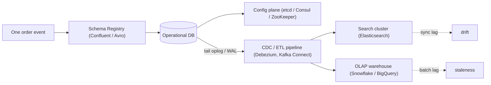
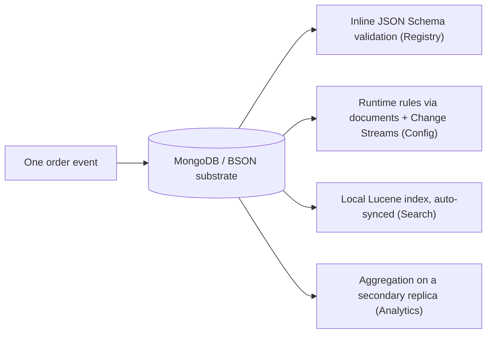

# Stop Paying the ETL Tax: How to Consolidate Your Technical Stack

Pull up the architecture diagram for almost any enterprise system built in the last decade, and you are looking at a game of architectural Jenga. Every block is load-bearing. Every block was added for a good reason. And everyone on the team is quietly terrified of pulling the wrong one.

Here is the part nobody likes to say out loud: most of those blocks aren't your application. They're *connective tissue* — infrastructure you stood up not to build features, but to shuttle a single business fact between systems that refuse to talk to each other.

Let's make it concrete. Watch what happens to one humdrum event — an e-commerce order, a user signup — as it tries to land in your stack:

1. It validates its shape against a detached **Schema Registry** cluster.
2. It fetches feature flags and routing rules from a distributed **Configuration** store.
3. It writes its core state to an operational database.
4. An ETL pipeline tails that write and ships it to a dedicated **Search Engine** for fuzzy text lookup.
5. A second pipeline batches it into an OLAP **warehouse** so analysts can see it.



That is five distributed systems, five consensus models, five query dialects, five on-call rotations, and a combinatorial number of ways for network lag or a silent sync bug to corrupt the one thing your business actually cares about: the truth of what happened.

So here is the question this post exists to answer: **what if you could collapse four of those five planes — Registry, Config, Search, and Analytics — into a single data substrate?**

You can. And the secret weapon isn't some heroic new orchestrator that sits *on top* of the mess. It's a quieter, more structural idea: the **BSON document layer underneath MongoDB**. What follows is the architectural case for treating MongoDB not as "the database box in the diagram," but as the engine consolidator that lets you delete four of the other boxes.

---

## First, name the tax you're actually paying

Before the solution, be honest about the bill. Multi-engine architectures don't fail loudly. They bleed you through three taxes that never show up on a single invoice:

- **The ETL tax.** Every arrow between two systems is a pipeline someone writes, monitors, alerts on, and gets paged for at 3 a.m. The pipeline is pure overhead — it produces no feature, only the *appearance* that two stores agree.
- **The drift tax.** The moment data exists in two places, it can disagree. Search says the product is in stock; the database says it sold out four minutes ago. Whoever's pipeline is lagging wins, and your customer loses.
- **The cognitive tax.** Your engineers must be fluent in SQL *and* a Lucene query DSL *and* HCL *and* Kafka Streams semantics — and worse, fluent in the *failure modes* of all four at their seams. The hardest bugs always live in the gaps between systems, where no single team owns the whole story.

None of these taxes buy you capability. They are the cost of fragmentation itself. And fragmentation, it turns out, usually traces back to a single root cause.

---

## The hidden power of the BSON substrate

Architectures fragment because of **rigid data modeling**. The instant a database forces you to flatten a rich domain object into strict, pre-declared tables, you start reaching for sidecar technologies to handle everything the tables can't: the nested data, the variable shapes, the search index, the analytics rollup. Each sidecar is a confession that your primary store couldn't hold the shape of your problem.

**BSON (Binary JSON)** removes the root cause. It is a polymorphic super-type substrate: it carries advanced native types out of the box (`Date`, `Decimal128`, `ObjectId`, `BinData`), it nests arrays and sub-documents to arbitrary depth, and — crucially — a single collection can hold documents of genuinely *different shapes* without apology.

Two consequences fall out of that, and they're the whole foundation for everything below:

- **Locality of reference.** Related data lives together, on the same disk pages, in one document. You stop paying for the network hops and the ORM impedance-mismatch gymnastics that define multi-engine life. The data doesn't have to *leave home* to be validated, searched, or analyzed.
- **One representation, end to end.** The thing you write is the thing you index is the thing you query is the thing you analyze. No `JSON → Protobuf → Avro → Lucene doc → Parquet` translation chain, each link a place for meaning to quietly rot.

BSON is what makes the four collapses below not just possible, but boring — in the best possible way.

---

## 1. Collapsing the Schema Registry

Detached registries — Confluent Schema Registry, an API-gateway contract store — exist for a real reason: applications need one authoritative place that says "this is what a `payment.v2` event looks like." The mistake isn't *having* a source of truth. It's keeping that source of truth on the far side of a network call from the data it governs. Validation that lives somewhere your data isn't will eventually be bypassed, version-skewed, or both.

In a collapsed architecture, **the database is the registry.** MongoDB enforces shape server-side with native **JSON Schema validation**, and — because schemas are themselves just documents — you can store the contract right next to everything it describes:

```json
// The contract and the data, governed in one place.
{
  "_id": ObjectId("65f1a2b3c4d5e6f7a8b9c001"),
  "artifact_id": "com.enterprise.payment.v2",
  "status": "ACTIVE",
  "schema_definition": {
    "$jsonSchema": {
      "bsonType": "object",
      "required": ["transaction_id", "amount", "currency"],
      "properties": {
        "transaction_id": { "bsonType": "string" },
        "amount":         { "bsonType": "decimal" },
        "currency":       { "bsonType": "string", "enum": ["USD", "EUR", "GBP"] }
      }
    }
  }
}
```

And you bind that same shape to the live collection as a validator, so it is enforced *inline on every write* — no out-of-band call, no "we'll validate it in the consumer" promise that never holds:

```javascript
db.runCommand({
  collMod: "payments",
  validator: { $jsonSchema: { /* the v2 shape, enforced on every insert/update */ } },
  validationLevel: "strict"
});
```

The payoff is the part you can't get when the registry is a separate system: promoting an artifact to a new version *and* updating the data it governs happens inside a **single multi-document ACID transaction**. The schema and the records it describes move together or not at all. No drift window, no "which one deployed first," no bypass.

---

## 2. Collapsing dynamic configuration

Distributed config planes — `etcd`, `Consul`, `ZooKeeper` — get introduced because teams need three specific things for feature flags and routing tables: strict consistency, high availability, and *reactive* notification when a value changes. Those are legitimate requirements.

But here's the architectural tell: you are running a second Raft or Paxos cluster *right next to* a database whose entire job is already strict, replicated consensus. That's not adding a capability. That's duplicating your most expensive piece of infrastructure for a workload your existing one already serves.

Store config as BSON documents and you inherit MongoDB's consensus for free — **majority write concern, linearizable reads** — plus the one feature people assume requires a dedicated config plane: real-time reactive updates, via **Change Streams**. Your services don't poll. They subscribe:

```javascript
// A microservice reacting to config changes the instant they commit.
const pipeline = [
  { $match: { operationType: "update", "fullDocument.env": "production" } }
];

const stream = db.collection("system_configs").watch(pipeline, {
  fullDocument: "updateLookup"
});

stream.on("change", (event) => {
  FeatureFlagManager.apply(event.fullDocument.flags);
});
```

Flip a flag, and the database pushes the delta to every subscribed service in milliseconds — driven by the same oplog that powers replication, so it is consistent *with the data by construction*. Better still: because the flag and your operational records live in the same database, you can change application behavior and the data it acts on inside **one atomic transactional boundary**. "Enable the new pricing engine and migrate the affected orders" stops being a distributed saga and becomes a single commit.

**One scoping line, so the claim stays honest.** What collapses here is *application and runtime* configuration — feature flags, pricing rules, routing tables, the values your services *read and react to*. This is **not** an argument for ripping out low-level infrastructure service discovery or machine-level clustering. `etcd` and `Consul` also do leader election, service registries, and network-topology/health routing for the cluster *underneath* your application — and the substrate that depends on that layer can't be the thing that bootstraps it (your database can't register its own nodes in a discovery plane it's running inside). Collapse the config your app *consumes*; leave the plumbing that decides where your app *runs* exactly where it is.

**And one geography caveat.** This maps cleanly onto a single-region deployment or a standard replica set. Go *globally* distributed and the quorum math changes: a dedicated consensus system like `etcd` handles cross-region elections and partition behavior differently than a globally-sharded or multi-region MongoDB topology, where write latency and failover semantics depend heavily on how you've placed primaries and configured read/write concerns. Collapse regional and application config freely; for *global* traffic-routing configuration, pressure-test the latency and partition story before you fold it in — some setups will still favor a purpose-built consensus network.

**And one security line.** There's a compliance edge worth respecting. Dedicated secret stores (Vault, and to a degree `etcd`/`Consul`) guard credentials, API keys, and TLS material behind specialized KMS integration and fine-grained RBAC. Folding *feature flags and routing rules* into the database is clean; folding *secrets* in right next to customer data can muddy an audit (SOC 2, PCI-DSS) by blurring the boundary between who may touch operational secret spaces and who may touch application data. Collapse the non-sensitive runtime config; keep high-value secrets and credentials in a dedicated vault with its own access boundary, even when everything else comes home.

---

## 3. Collapsing the search engine

This is where the modern stack gets genuinely grim. The moment a product manager says the words "autocomplete," "fuzzy matching," or "search across these fields," the reflex is to stand up an external Elasticsearch or OpenSearch cluster — and then to build, staff, and forever debug a change-data-capture pipeline (Debezium, Kafka Connect, a homegrown log-tailer) whose only job is to keep that cluster from lying.

That pipeline *is* the drift tax made flesh. It is the single most common source of "the search results don't match the database" bugs, and it is pure operational weight with zero feature value.

With MongoDB's **native search** — on Atlas, or self-managed in Community Edition (more on that in the appendix, because it kills the lock-in objection outright) — the pipeline evaporates. A Lucene-powered index lives alongside your data and stays in sync with it automatically — **no CDC connector to build, no Kafka topic to babysit, no second cluster to feed.** When a document changes, the index reflects it; you didn't write a line of plumbing to make that true. And because search and query are the same engine, you can do full-text relevance *and* hard operational filtering in a single pipeline:

```javascript
db.products.aggregate([
  {
    $search: {
      index: "products_text",
      text: { query: "noise canceling headphones", path: "description", fuzzy: {} }
    }
  },
  // Same query, same engine: now apply the operational facts.
  { $match: { status: "AVAILABLE", warehouse_id: "WH-EAST" } },
  { $limit: 20 }
]);
```

Notice what *didn't* happen: you didn't query a search cluster for IDs, then turn around and query the database to re-hydrate and re-filter those IDs (the classic two-hop dance that reintroduces drift between the two reads). One query. One source of truth. And if you need to match by *meaning* rather than keywords, **native vector search** stores the embedding as just another field on the same document — semantic search with no third system bolted on.

---

## 4. Collapsing the real-time analytics plane

The old guard's objection arrives on schedule: *"Operational databases can't do analytics without tanking production."* That was true — for legacy relational systems where one engine served one query pattern and a heavy report could lock your checkout flow. Modern BSON architectures handle it with **physical workload isolation** instead of physical *system* separation.

Using **read preferences**, you route heavy analytical queries to dedicated, non-voting secondary replicas. Your transactional traffic never feels it; your analysts hammer a node that holds *identical, live* data — not a warehouse copy that's six hours and one broken batch job behind:

```javascript
db.orders.aggregate(
  [
    { $match: { status: "FULFILLED", region: "NA" } },
    {
      $setWindowFields: {
        partitionBy: "$customer_id",
        sortBy: { fulfilled_at: 1 },
        output: { running_ltv: { $sum: "$amount", window: { documents: ["unbounded", "current"] } } }
      }
    },
    { $group: { _id: "$cohort", avg_ltv: { $avg: "$running_ltv" }, orders: { $sum: 1 } } },
    { $merge: { into: "cohort_dashboards", whenMatched: "replace" } }
  ],
  { readPreference: "secondaryPreferred" }
);
```

The **Aggregation Framework** is a real declarative processing engine — window functions, multi-stage grouping, complex transforms — not a bolted-on afterthought. Pair it with native **time-series collections** for high-volume event data and on-demand materialized views (`$merge`), and you get blazing real-time operational dashboards *without ever moving a byte out to a separate warehouse*. The analytics run on the data, where the data already is.

**Two cautions keep this honest, though.** First, *isolation isn't immunity*. Routing the read off the primary protects your checkout flow — but a secondary serving a massive, **unindexed** aggregation can pin its own CPU and RAM, and a saturated secondary then falls behind on *applying the oplog* (it has to replay every primary write while it grinds through your scan). You've protected primary reads at the cost of **replication lag on the analytical node** — stale dashboards, and, if it lags far enough, a node that drops out of the recovery window entirely. So index the fields your aggregations actually touch, and treat *replication lag under heavy analytical load* as a first-class alert, not an afterthought.

Second, watch the **write-back** — it's the asymmetry that bites. Read preferences isolate the read path, but the final `$merge` (and `$out`) is a *write*, and writes have exactly one home — the **primary** — from which they replicate to every secondary like any other change. So an analyst who dumps millions of rows into `cohort_dashboards` at 2 p.m. hasn't isolated that cost; they've injected a heavy write burst into your transactional primary and handed every secondary a replication-lag spike at peak. The fix isn't to abandon materialized views — it's to *schedule* the expensive ones: full rebuilds in off-peak windows, prefer **incremental `$merge`** over changed partitions instead of wholesale replacement, and (again) treat replication lag as the metric you actually watch. The substrate gives you a *place* to run analytics next to production; keeping it safe — on both the read tail and the write burst — is still an operational discipline.

---

## The proof case: one event's journey through a collapsed stack

Abstractions are easy to sell and hard to believe. So trace that same order again — but this time through the consolidated substrate, and watch how many systems it *doesn't* touch:



The transaction hits MongoDB. Inline validation verifies its shape — that's your **Registry**, evaluated before the write lands. The same transaction reads runtime rules from a config document — that's your **Config** plane, consistent by construction. The write commits, and the co-located index reflects it immediately — that's your **Search**, with no pipeline in the loop. A heartbeat later, an analytical query on an isolated replica feeds the BI dashboard the *exact same fact* — that's your **Analytics**, on live data.

One technology. One operational paradigm. One data format, end to end.

| Dimension | The fragmented way | The collapsed BSON way |
| --- | --- | --- |
| **Moving parts** | 5 engines, 5 consensus models, 5 query dialects | **1 substrate, 1 operational paradigm** |
| **Data format** | JSON → Protobuf → Avro → Lucene doc → Parquet | **Pure BSON, end to end** |
| **Data drift** | High — pipeline lag and silent sync bugs between stores | **Zero — inline, local indexing** |
| **Transactions** | Fragile distributed sagas across networks | **Native multi-document ACID** |
| **Consensus** | Duplicated — DB replication *and* a separate Raft/Paxos config cluster | **One replication protocol** |
| **Cognitive load** | SQL + Lucene DSL + HCL + Kafka Streams + their seams | **One query API and aggregation pipeline** |
| **On-call surface** | Five systems, five rotations, N² failure modes at the joins | **One platform, physically isolated workloads** |

---

## Now the honest part: when *not* to collapse

A post that only sells you the upside isn't an engineering argument — it's a brochure. So here is the steelman, because knowing the boundary is what makes the rule trustworthy.

- **Petabyte-scale, columnar OLAP is still a warehouse job.** MongoDB's analytics shine for *real-time operational* questions on live, working-set data. If your use case is scanning ten years of immutable history with massive columnar compression for a quarterly crunch, a purpose-built warehouse (Snowflake, BigQuery, ClickHouse) will out-economize you. Collapse the *real-time* analytics plane; don't pretend you've deleted the data lake.
- **Bleeding-edge search relevance has a ceiling.** Atlas Search covers the overwhelming majority of "make this findable" needs without a pipeline. But if you have a dedicated relevance team tuning custom analyzers, learning-to-rank models, and exotic scoring, a standalone Elasticsearch with its full knob set may still be worth its operational weight. Most teams are nowhere near that ceiling — but some genuinely are.
- **"One system, one blast radius" is a fair worry — and the answer is isolation, not separation.** Collapsing planes does *not* mean one undifferentiated node serving everything: analytics runs on dedicated secondaries, search on its own co-located index nodes. One well-run, well-understood system has a far smaller real-world blast radius than four loosely-coupled ones held together by pipelines that drift the moment you stop watching them. But be clear-eyed about the flip side: once config lives in the database, a catastrophic outage — or even a long primary-election pause — costs you more than your data store, because your services lose feature flags *and* internal routing at the same moment. The fix is to design for it — cache *last-known-good* config and degrade gracefully, so a brief election can't cascade into an outage. You're concentrating your eggs in one very well-fortified basket; just don't forget it's still one basket.
- **Sunk investment is real.** If you already operate a mature, humming Kafka-and-Elasticsearch estate that your team knows cold, "rip it out" is rarely the right Tuesday. The argument here is sharpest for *new* systems and for the next time you're about to reflexively add engine number five.

The thesis isn't "delete every specialized tool." It's "stop adding specialized tools to solve problems your primary substrate already solves." Reserve the sidecars for the genuinely extreme workloads that earn them. Collapse everything else.

---

## The bottom line: optimize for systemic sanity

Defending MongoDB's place at the center of the stack was never about winning a micro-benchmark. You can always find a workload where a single-purpose engine edges out a generalist on one dimension. That's the wrong scoreboard.

The right scoreboard is the *whole system*: the pipelines you didn't have to write, the drift bugs that can't exist because there's only one copy of the truth, the 3 a.m. pages that never fire because there's no seam to fail at, the engineers spending their week shipping features instead of reconciling stores that disagree.

Collapse the Registry, the Config plane, the Search engine, and the real-time Analytics layer into one BSON substrate, and what you're really buying isn't a feature. It's the *absence* of structural complexity — surface area you no longer have to operate, reason about, or keep from quietly drifting apart.

Your stack is probably four engines too big. The most senior thing you can do this quarter might be to make it smaller.

---

## Appendix: the "cloud lock-in" objection is officially dead

If you'd pitched this architecture a few years ago, the most seasoned infrastructure engineer in the room would have cut you off — and they'd have been *right* to:

> *"Sure, this works great — if you hand your entire infrastructure budget to MongoDB Atlas. Native search is a proprietary, walled-garden cloud feature. The moment we need to run self-managed, on-prem, or just locally in a disconnected dev environment, we're back to babysitting our own Elasticsearch and a vector database on the side. You haven't collapsed the stack; you've rented the collapse."*

For years, that objection was airtight. The engine-collapsing magic — native full-text and vector search living *inside* the database — was an Atlas-only luxury. Take away the cloud and the sidecars came right back, dragging the ETL tax and the drift tax with them.

That objection is now dead.

### Native search came home to Community Edition

As of **MongoDB Community Edition 8.2**, native full-text *and* vector search ship in the free, source-available build. The same `$search`, `$searchMeta`, and `$vectorSearch` stages — plus autocomplete, fuzzy matching, faceting, hybrid search, and RAG — run on your laptop (in a container), inside your own Kubernetes clusters, or on bare metal in a private data center. No enterprise cloud contract required to collapse your stack.

### How it works under the hood

The self-managed architecture mirrors the cloud one. A companion binary, **`mongot`**, runs alongside your database:

- **Zero-tax sync.** `mongot` attaches to your replica set and keeps its Lucene indexes current through **Change Streams** — the same oplog-driven mechanism that powers replication. You still write *zero* lines of ETL plumbing, and there's still no second copy of the truth to drift.
- **Unified querying.** Your application talks only to `mongod`. When you run a `$search` or `$vectorSearch` stage, the database transparently proxies the heavy lifting to `mongot` and hands you back one clean, unified result set. The two-binary split is an implementation detail you mostly never see.
- **Automated embeddings.** Newer builds can generate vectors for you at ingest and query time, so even the embedding pipeline — usually its *own* sidecar — collapses into the substrate.
- **Scales with your shards.** On a sharded cluster the model stays horizontal: each shard runs its own `mongot`, indexing only the data that lives on it, so search capacity grows *with* the cluster instead of bottlenecking on one central index node. The `mongos` router fans a `$search` out across shards and merges the results — the same scale-out story as the data underneath it.

### The one knob you must turn up: the oplog

Here's the second-order effect a principal architect will flag before you finish the sentence. Notice what every "reactivity for free" collapse in this post leans on: the **same** finite resource — the oplog. Change Streams (your Config plane) tail it. `mongot` (your Search index) tails it. Replication itself lives on it. Consolidating engines doesn't just delete clusters; it *concentrates* load onto one shared replication log.

On a highly transactional system that is a genuine operational risk. A write burst can roll the oplog window faster than a consumer drains it, and any stream — a Change Stream or a `mongot` index — that falls off the trailing edge of the oplog must **resync from scratch** (an expensive, lag-inducing rebuild at the worst possible moment). So when you collapse Search and Config onto MongoDB, **size the oplog up deliberately**, well past the default, so it holds enough history to absorb write spikes, deploys, and consumer hiccups. It's effectively one setting — `replSetResizeOplog` on a running set, or `--oplogSize` / `storage.oplogSizeMB` at provisioning — and it is the cheapest insurance you'll buy all quarter. The engines collapse; the replication log has to *grow* to carry them.

### The honest status (because receipts cut both ways)

Be precise about where this sits today: native search in Community Edition shipped as a **public preview, aimed at development and evaluation rather than production**, on a path to GA under the Server Side Public License. It currently targets **Linux, Docker, and the Kubernetes Operator** (not native macOS/Windows), and MongoDB recommends running the search components on dedicated infrastructure for real performance — which is exactly the "physical workload isolation, not system separation" principle from the analytics section, applied to search.

So the honest claim isn't "rip out Elasticsearch in production this afternoon." It's stronger and more useful: **the architectural tax, the synchronization tax, and the cloud lock-in tax are no longer structural facts you have to design around.** You can stand up the entire collapsed, single-substrate stack — search and vectors included — in a local container today, build against it, and carry the *same* architecture all the way to a managed Atlas cluster without swapping engines on the way.

### What you delete vs. what you inherit

Keep one distinction sharp, though: collapsing search deletes the *pipeline*, not the *process*. The CDC connector, the Kafka topic, the perpetual drift between two stores — those genuinely vanish, and that's the bulk of the win. But `mongot` is still a separate, **Lucene-based (JVM) process** with its own resource profile sitting next to your data layer. Self-managing it means owning the things any Java indexer drags along: heap sizing and GC behavior, an eye on its memory footprint, and — if you co-locate it on the same box as `mongod` instead of the dedicated infrastructure MongoDB recommends — real **memory contention right beside your operational workload**. There's an **observability shift**, too: you're trading Elasticsearch's mature SRE ecosystem — APM integrations, index-lifecycle (ILM) dashboards, deep cluster diagnostics your team already reaches for — for MongoDB-native search metrics. The signals exist (`mongot` exposes its own index and health stats), but the tooling and the muscle memory have to be rebuilt before your on-call can debug it at 3 a.m. So be precise about the trade: you're not deleting operational surface area, you're *changing its shape* — from "a distributed pipeline you build, monitor, and get paged for" to "a co-resident process you size and tune." That's a far better trade (one log-synced companion beats N drifting systems), but it isn't free. Capacity-plan `mongot` like the memory-hungry search engine it is, not like a feature you switched on.

### Bring the receipts

- **The announcement:** [Public Preview: MongoDB Community Edition Now Offers Native Full-Text and Vector Search](https://www.mongodb.com/products/updates/public-preview-mongodb-community-edition-now-offers-native-full-text-and-vector-search/) — the `mongot`-plus-Change-Streams design, in MongoDB's own words.
- **The capability breakdown:** the [MongoDB Community Edition product hub](https://www.mongodb.com/products/self-managed/community-edition) — `$search`, `$vectorSearch`, hybrid search, and automated embeddings, confirmed self-managed and free.
- **The deployment guide:** [Search and Vector Search on self-managed MongoDB](https://www.mongodb.com/docs/kubernetes/current/fts-vs-deployment/) — how to deploy `mongod` + `mongot` via the Kubernetes Operator, for the infrastructure purists who want to see the YAML.

The walled garden has no walls anymore. If you want to delete four engines from your stack, you don't need a procurement cycle — you need a container and an afternoon.
